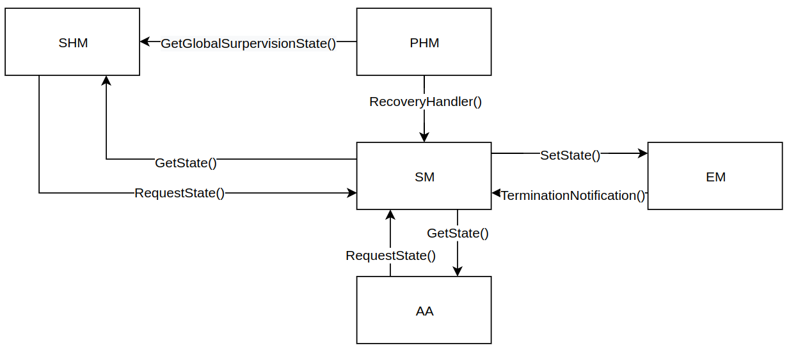
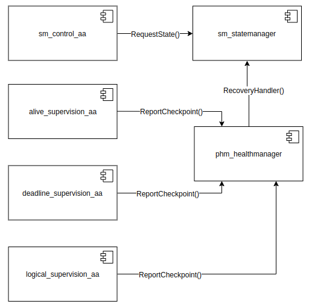
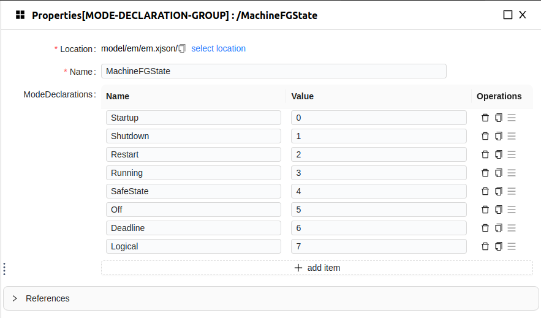

# 1 背景

在自动驾驶应用中，通常采用的是SOC+MCU的硬件架构，SOC中执行感知、预测、规划等复杂算法，MCU中执行控制类高实时算法和安全相关模块。SOC中各类算法和功能模块以不同的进程部署在系统中，当进程内出现死锁、执行阻塞、软件要素间不同步等问题时，会导致端到端的延迟变高，甚至系统功能失效等问题，从而引发事故风险。

那么，如何解决这类问题呢？

功能安全ISO26262中要求，在汽车软件开发过程中安全相关的模块需要对其程序的时时序和执行进行监控，以识别系统的故障和异常，触发恢复操作。AUTOSAR AP针对该需求引入了PHM（平台健康管理）功能集群，可实现保活（Alive）、截至时间（Deadline）和逻辑（Logical）三种类型的监督模式，还可通过安全通道报告监督的外部故障（如电压故障、零部件故障等）。

SM（状态管理）模块可收集PHM监督结果，从而决定其内部状态机的状态，执行恢复、降级等动作。

# 2 功能简介

## 2.1 PHM-平台健康管理

PHM是AUTOSAR AP平台上的平台健康管理功能集群，负责监控应用的时序约束（保活监督、截至期限监督）、逻辑程序序列（逻辑监督）以及平台健康状况（健康通道监督）。在监测到故障时，平台健康管理会通知状态管理。从而触发适当的恢复操作。平台健康管理还具有与硬件看门狗的接口，当发生严重故障时，可以触发看门狗反应。

## 2.2 依赖模块

### 2.2.1 EM-执行管理

EM是AUTOSAR AP平台上的执行管理功能集群，负责AUTOSAR AP建模进程的初始化、启动和关闭。

### 2.2.2 SM-状态管理

SM是AUTOSAR AP平台上的状态管理功能集群，它根据从其他的AUTOSAR平台应用和用户应用程序接收的事件，决定其内部的状态机状态。平台事件包括平台健康管理模块的监督状态、健康通道状态和EM程序执行错误状态等。在不同状态机状态下基于项目需求可以配置为控制网络管理的状态，功能组或者机器状态。状态管理模块的状态机可特定于进行定制化设计。

# 3 XwayOS实现介绍

XwayOS中间件基于AUTOSAR AP 22-11标准实现了PHM全功能, 可满足功能安全对程序执行时序的监督需求。此外，XwayOS还基于PHM模块功能实现了SHM系统健康管理标准服务，针对智驾域安全监督提出了一套完整的解决方案。



# 4 功能演示

## 4.1 示例设计

演示示例采用如下架构，alive、deadline和logical/health监督分别在不同的应用进程中进行测试，每个进程对应不同的功能组状态。

sm_control_aa模块负责启动时请求状态切换以启动alive_supervision_aa应用。

alive_supervision_aa模拟用户应用的周期执行任务，phm对其进行alive监督，程序正常执行一段时间主动触发异常结束循环，alive监督监测到异常后将异常状态报告给sm模块，sm请求状态机状态切换，而后切换机状态启动deadline_supervsion_aa应用。

deadline_supervsion_aa模拟对用户任务执行时间进行监控，正常执行一段时间后主动触发执行异常，deadline监督监测到异常后触发sm状态机切换，机器状态随随之切换，关闭deadline_supervsion_aa应用，启动logical_supervision_aa应用。

logical_supervision_aa应用正常执行，且在某个时刻通过健康通道发出异常健康信息，触发sm状态机切换使整个系统进入shutdown状态，随后整个测试流程结束。



示例运行流程:

1. 启动时，机器状态（MachineFG）为Startup，em会启动三个进程phm_healthmanager、sm_statemanager、sm_control_aa；
2. sm_control_aa判断当前机器状态为Startup时，向sm请求状态机状态切换，机器状态（MachineFG）切换为Running状态；
3. 机器状态为Running状态时，会拉起进程alive_supervision_aa。
4. alive_supervision_aa会按500ms周期上报21次保活监督，而后退出循环停止上报，触发phm中保活失败的恢复行为（error code：101，用户配置）。
5. sm收到错误码101后，触发状态机切换，状态机的行为将机器状态切换到Deadline；
6. 机器状态为Deadline状态时，将关闭alive_supervision_aa应用，拉起deadline_supervision_aa应用；
7. deadline_supervision_aa应用会上报20次超时监督，即10个source → target的周期，每次上报的间隔为500ms，随后完成source检查点上报后停止检查点上报，触发phm中执行超时的恢复行为（error code：102，用户配置）；
8. sm收到错误码102后，触发状态机切换，状态机的行为将机器状态切换到Logical状态；
9. 机器状态切换至Logical后，会停止deadline_supervision_aa应用，拉起logical_supervision_aa应用；
10. logical_supervision_aa进程会上报10个 source → transition → target的周期，每次上报逻辑监督的间隔为100ms，随后上报健康通道状，状态id为31；
11. sm收到状态码31后，触发状态机切换，状态机的行为将机器状态切换到Shutdown状态；
12. 关闭所有应用程序，测试流程结束。

## 4.2 示例配置

### 4.2.1 功能组配置

| 功能组名称及状态功能 | 在此功能组状态下运行的进程                                                                                  | 在此功能组状态下运行的全局监督/健康通道，及其所属的进程col                                                                                                           |
| -------------------- | ----------------------------------------------------------------------------------------------------------- | -------------------------------------------------------------------------------------------------------------------------------------------------------------------- |
| MachineFG::Startup   | phm_healthmanager<br />statemanager_daemon<br />sm_control_app_exe                                          | 无                                                                                                                                                                   |
| MachineFG::Running   | phm_healthmanager<br />statemanager_daemon<br />sm_control_app_exe<br />AliveSupervisionTest                | /phm_deploy/PlatformHealthManagement/AliveGlobalSupervision（AliveSupervisionTest）                                                                                  |
| MachineFG::Deadline  | phm_healthmanager<br />statemanager_daemon<br />sm_control_app_exe<br />DeadlineSupervisionTest             | /phm_deploy/PlatformHealthManagement/DeadlineGlobalSupervision（DeadlineSupervisionTest）                                                                            |
| MachineFG::Logical   | phm_healthmanager<br />statemanager_daemon<br />sm_control_app_exe<br />LogicalSupervisionHealthChannelTest | /phm_deploy/PlatformHealthManagement/LogicalGlobalSupervision（LogicalSupervisionHealthChannelTest）<br />RandomHealthChannel（LogicalSupervisionHealthChannelTest） |



### 4.2.2 GlobalSupervision配置

| GlobalSupervision名称                                          | 包含的监督             | 监督配置信息                                                                                                                                                                                             | 触发错误码 | 运行的功能组状态    |
| -------------------------------------------------------------- | ---------------------- | -------------------------------------------------------------------------------------------------------------------------------------------------------------------------------------------------------- | ---------- | ------------------- |
| /phm_deploy/PlatformHealthManagement/AliveGlobalSupervision    | alive<br />supervision | alive supervision：<br />alive_reference_cycle 1000，<br />failed_reference_cycles_tolerance： 0，<br />expected_alive_indications：2，<br />min_margin：1，<br />max_margin：1，<br />checkpoint_ref：0 | 101        | MachineFG::Running  |
| /phm_deploy/PlatformHealthManagement/DeadlineGlobalSupervision | deadline supervision   | deadline supervision：min_deadline：450，<br />max_deadline：550                                                                                                                                         | 102        | MachineFG::Deadline |
| /phm_deploy/PlatformHealthManagement/LogicalGlobalSupervision  | logical supervision    | logical supervision：<br />initial_checkpoint_refs：3，<br />final_checkpoint_refs：5                                                                                                                    | 103        | MachineFG::Logical  |

### 4.2.3 HealthChannel配置

| HealthChannel名称               | 健康通道中的健康状态（是否触发恢复行为）                        | 触发错误行为                            |
| ------------------------------- | --------------------------------------------------------------- | --------------------------------------- |
| phm_design::RandomHealthChannel | Ok = 30U,TriggerRecoveryNotification = 31U,（触发）Ignore = 32U | /phm_deploy/HealthChannelExternalAction |

## 4.3 示例执行

- 安装代码引擎

```
./CLI/install_xway_code_engine.sh
```

* 生成代码
  ```
  ./CLI/generate_code.sh
  ```
* 执行代码
  ```
  ./CLI/startup.sh
  ```
