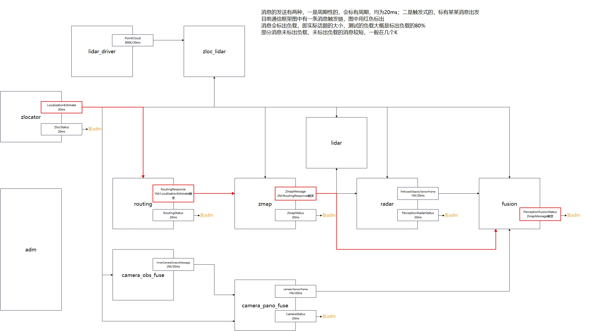
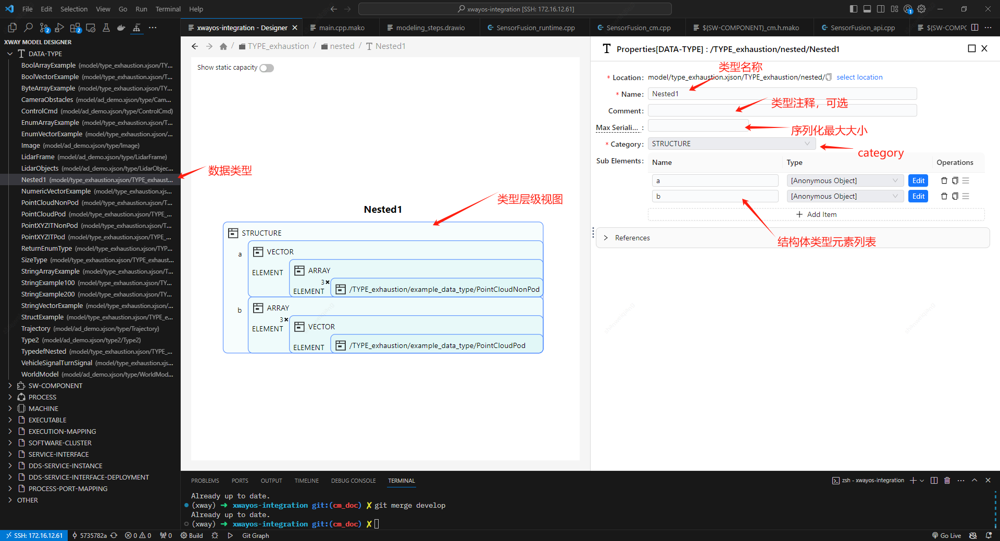
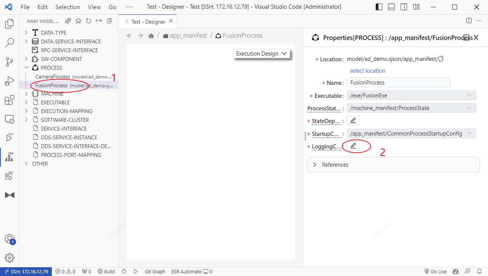
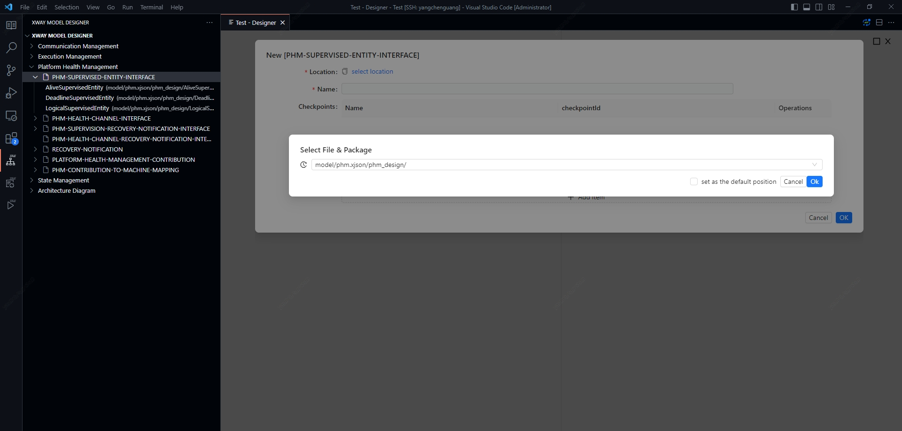
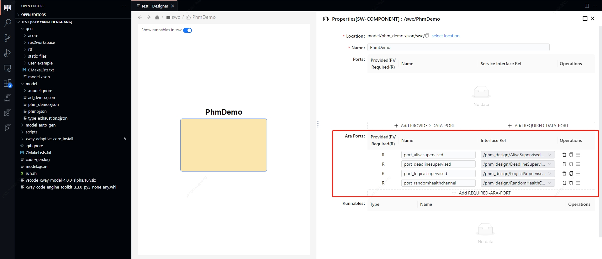
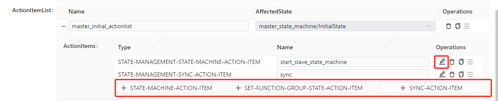
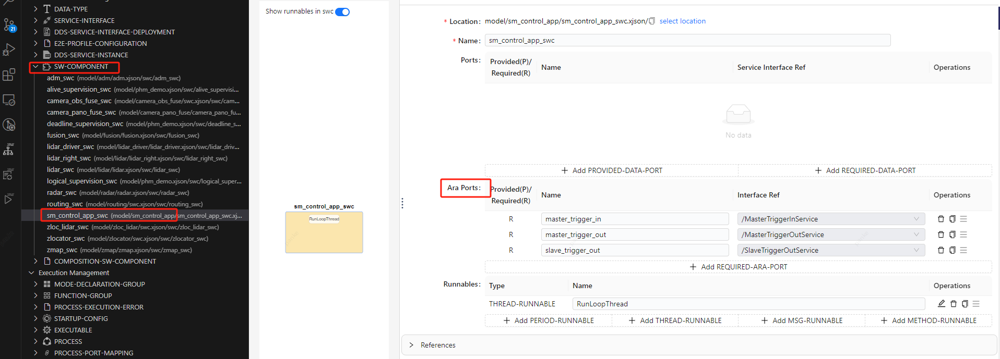
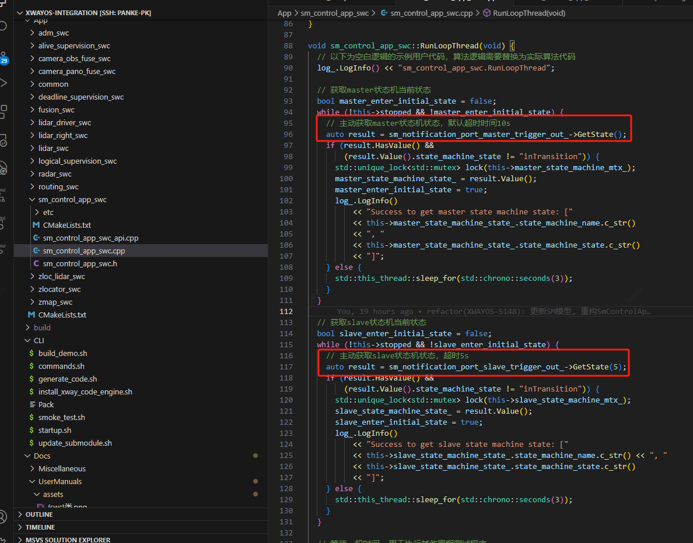
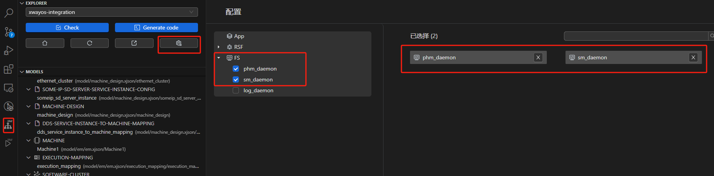

# 目录

- [目录](#目录)
- [版本](#版本)
- [1 引言](#1-引言)
  - [1.1 用户手册的目的和范围](#11-用户手册的目的和范围)
  - [1.2 使用本手册的前提条件](#12-使用本手册的前提条件)
  - [1.3 词汇表和缩略语](#13-词汇表和缩略语)
- [2 安装和配置](#2-安装和配置)
  - [2.1 XwayOS SDK运行环境](#21-xwayos-sdk运行环境)
- [2.2 用户开发环境准备](#22-用户开发环境准备)
  - [2.2.1 第三方工具链](#221-第三方工具链)
    - [2.2.1.1 CMake](#2211-cmake)
    - [2.2.1.2 编译器](#2212-编译器)
    - [2.2.1.3 python环境](#2213-python环境)
    - [2.2.1.4 vscode](#2214-vscode)
  - [2.2.2 XwayOS Studio工具链安装](#222-xwayos-studio工具链安装)
  - [2.2.2.1 XwayOS Studio前端](#2221-xwayos-studio前端)
    - [2.2.2.2 代码引擎](#2222-代码引擎)
  - [2.2.3 XwayOS-Builder Docker镜像](#223-xwayos-builder-docker镜像)
- [3 快速入门](#3-快速入门)
  - [3.1 示例工程目录介绍](#31-示例工程目录介绍)
  - [3.2 模型代码生成](#32-模型代码生成)
  - [3.3 用户代码集成](#33-用户代码集成)
    - [3.3.1 user\_api](#331-user_api)
    - [3.3.2 CMakeLists.txt](#332-cmakeliststxt)
  - [3.4 编译](#34-编译)
  - [3.5 运行](#35-运行)
  - [3.6 调试](#36-调试)
- [4 功能集成配置与接口应用](#4-功能集成配置与接口应用)
  - [4.1 CM](#41-cm)
    - [4.1.1 功能描述](#411-功能描述)
      - [4.1.1.1 基于服务的通信](#4111-基于服务的通信)
    - [4.1.2 模型配置](#412-模型配置)
      - [4.1.2.1 XwayOS通信模型概览](#4121-xwayos通信模型概览)
      - [4.1.2.2 模型功能介绍与配置步骤](#4122-模型功能介绍与配置步骤)
      - [4.1.2.3 配置DataType](#4123-配置datatype)
        - [4.1.2.3.1 基本数据类型](#41231-基本数据类型)
        - [4.1.2.3.2 自定义数据类型](#41232-自定义数据类型)
        - [4.1.2.3.3 数据类型的命名规范](#41233-数据类型的命名规范)
      - [4.1.2.4 配置ServiceInterface](#4124-配置serviceinterface)
      - [4.1.2.5 配置ServiceInterfaceDeployment](#4125-配置serviceinterfacedeployment)
      - [4.1.2.6 配置ServiceInstance](#4126-配置serviceinstance)
      - [4.1.2.7 配置SWC](#4127-配置swc)
      - [4.1.2.8 配置COMPOSITION-SWC](#4128-配置composition-swc)
      - [4.1.2.9 配置ProcessPortMapping](#4129-配置processportmapping)
      - [4.1.2.9 配置InstanceToMachineMapping](#4129-配置instancetomachinemapping)
    - [4.1.3 生成的代码与清单](#413-生成的代码与清单)
      - [4.1.3.1 进程配置清单](#4131-进程配置清单)
        - [4.1.3.1.1 清单位置](#41311-清单位置)
        - [4.1.3.1.2 网络绑定配置文件](#41312-网络绑定配置文件)
        - [4.1.3.1.3 DDS协议配置清单](#41313-dds协议配置清单)
        - [4.1.3.1.4 Qos配置](#41314-qos配置)
      - [4.1.3.2 CM进程配置清单与EM的关联](#4132-cm进程配置清单与em的关联)
  - [4.2 EM](#42-em)
    - [4.2.1 功能描述](#421-功能描述)
      - [4.2.1.1 XwayOS任务模型介绍](#4211-xwayos任务模型介绍)
    - [4.2.2 模型配置](#422-模型配置)
      - [4.2.2.1 模型概览](#4221-模型概览)
      - [4.2.2.2 模型介绍与配置步骤](#4222-模型介绍与配置步骤)
        - [4.2.2.2.1 配置EXECUTABLE](#42221-配置executable)
        - [4.2.2.2.2 配置MachineState(MODE-DECLARATION-GROUP)](#42222-配置machinestatemode-declaration-group)
        - [4.2.2.2.3 配置MachineFG(FUNCTION-GROUP)](#42223-配置machinefgfunction-group)
        - [4.2.2.2.4 配置ProcessState(MODE-DECLARATION-GROUP)](#42224-配置processstatemode-declaration-group)
        - [4.2.2.2.5 配置STARTUP-CONFIG](#42225-配置startup-config)
        - [4.2.2.2.6 配置PROCESS](#42226-配置process)
        - [4.2.2.2.7 配置ETHERNET-CLUSTER](#42227-配置ethernet-cluster)
        - [4.2.2.2.8 配置MACHINE-DESIGN](#42228-配置machine-design)
        - [4.2.2.2.9 配置MACHINE](#42229-配置machine)
        - [4.2.2.2.10 配置EXECUTION-MAPPING](#422210-配置execution-mapping)
        - [4.2.2.2.11 配置SOFTWARE-CLUSTER](#422211-配置software-cluster)
      - [4.2.2.3 生成物介绍](#4223-生成物介绍)
  - [4.3 LOG](#43-log)
    - [4.3.1 功能描述](#431-功能描述)
    - [4.3.2 模型配置](#432-模型配置)
    - [4.3.3 应用接口](#433-应用接口)
      - [4.3.3.1 初始化](#4331-初始化)
      - [4.3.3.2 生产日志消息](#4332-生产日志消息)
      - [4.3.3.3 生产日志消息前缀](#4333-生产日志消息前缀)
      - [4.3.3.4 生产日志消息正文](#4334-生产日志消息正文)
        - [4.3.3.4.1 接口operator\<\<(value)](#43341-接口operatorvalue)
        - [4.3.3.4.2 接口Arg(value)](#43342-接口argvalue)
        - [4.3.3.4.3 接口Arg(ara::core::StringView name,value)](#43343-接口argaracorestringview-namevalue)
        - [4.3.3.4.4 接口Arg(ara::core::StringView name,value,ara::core::StringView unit)](#43344-接口argaracorestringview-namevaluearacorestringview-unit)
      - [4.3.3.5 控制日志消息](#4335-控制日志消息)
      - [4.3.3.5.1 设置日志严重等级](#43351-设置日志严重等级)
      - [4.3.3.5.2 读取日志严重等级](#43352-读取日志严重等级)
      - [4.3.3.5.3 自动“落盘”与主动“落盘”](#43353-自动落盘与主动落盘)
  - [4.4 PHM](#44-phm)
    - [4.4.1 功能描述](#441-功能描述)
    - [4.4.2 模型配置](#442-模型配置)
      - [4.4.2.1 模型概览](#4421-模型概览)
      - [4.4.2.2 模型配置](#4422-模型配置)
      - [4.4.2.2.1 配置PHM-SUPERVISED-ENTITY与PHM-HEALTH-CHANNEL](#44221-配置phm-supervised-entity与phm-health-channel)
      - [4.4.2.2.1 配置进程上报端口与PLATFORM-HEALTH-MANAGEMENT-CONTRIBUTION](#44221-配置进程上报端口与platform-health-management-contribution)
      - [4.4.2.3 生成物介绍](#4423-生成物介绍)
  - [4.5 SM](#45-sm)
    - [4.5.1 功能描述](#451-功能描述)
    - [4.5.2 模型配置](#452-模型配置)
      - [4.5.2.1 模型概览](#4521-模型概览)
      - [4.5.2.2 配置功能组](#4522-配置功能组)
      - [4.4.2.3 配置状态机](#4423-配置状态机)
        - [4.5.2.3.1 配置StateMachines](#45231-配置statemachines)
        - [4.5.2.3.2 配置ActionItemList](#45232-配置actionitemlist)
      - [4.5.2.4 配置SmControlApp](#4524-配置smcontrolapp)
        - [4.5.2.4.1 配置请求服务](#45241-配置请求服务)
        - [4.5.2.4.2 配置通知服务](#45242-配置通知服务)
        - [4.5.2.4.3 配置SWC与ExecutionMapping](#45243-配置swc与executionmapping)
      - [4.5.2.5 配置Rules](#4525-配置rules)
        - [4.5.2.5.1 配置STATE-MANAGEMENT-TRIGGER-RULE](#45251-配置state-management-trigger-rule)
        - [4.5.2.5.2 配置STATE-MANAGEMENT-ERROR-RULE](#45252-配置state-management-error-rule)
      - [4.5.2.6 配置Machine](#4526-配置machine)
    - [4.5.3 生成物介绍](#453-生成物介绍)
    - [4.5.4 sm\_daemon进程配置](#454-sm_daemon进程配置)
  - [4.6 RTF](#46-rtf)
    - [4.6.1 功能描述](#461-功能描述)
    - [4.6.2 应用接口](#462-应用接口)
  - [4.7 工具链](#47-工具链)
    - [4.7.1 在线调试](#471-在线调试)
    - [4.7.1.1 远程调试](#4711-远程调试)
    - [4.7.1.2 本地调试](#4712-本地调试)
    - [4.7.2 远程部署（v3.0.0未包含）](#472-远程部署v300未包含)
    - [4.7.3 监控与分析（v3.0.0未包含）](#473-监控与分析v300未包含)
- [5 故障排除与支持](#5-故障排除与支持)
  - [5.1 模型校验故障排查](#51-模型校验故障排查)
- [6 参考文献](#6-参考文献)
- [7 附录](#7-附录)

# 版本

| 版本号        | 变更内容                                        | 责任人               |
| ------------- | ----------------------------------------------- | -------------------- |
| XwayOS v3.0.0 | 初始版本                                        | 潘常元               |
| XwayOS v4.0.0 | 更新PHM、SM章节内容，更新CM composition章节说明 | 潘科、杨晨光、单威强 |

# 1 引言

## 1.1 用户手册的目的和范围

本手册的目地是帮助用户如何使用XwayOS中间件产品开发自己的应用，包括依赖的环境，工具链，XwayOS SDK提供的示例工程的使用介绍等。以及进一步的XwayOS核心组件提供的功能，以及如何使用它们。

本手册阅读对象为应用层软件开发工程，中间件测试测试工程师。

## 1.2 使用本手册的前提条件

## 1.3 词汇表和缩略语

| 缩略语                       | 解释                                                                                                                                                                                          |
| ---------------------------- | --------------------------------------------------------------------------------------------------------------------------------------------------------------------------------------------- |
| XwayOS                       | 万途中间件系列产品，包含<br />- 符合AUTOSAR AP规范的ACore<br />- XwayOS Studio工具链<br />- 符合DDS规范的通信中间件<br />- 运行时框架RTF<br />- 运行时服务框架RSF（v3.0.0未包含）             |
| XwayOS Studio                | 万途中间件产品工具链，包含代码引擎、可视化建模工具、在线调试、在线通信与执行状态监控                                                                                                          |
| RTF                          | RunTime Framework运行时服务框架，提供中间件的抽象，并实现了调度编排、异常处理，信号处理等功能，使应用集成更加便捷                                                                             |
| ACore                        | 符合AUTOSAR AP规范的中间件，支持SOA开发，提供执行管理、日志、健康管理等功能                                                                                                                   |
| RSF                          | RunTime Service Framework由智驾平台通用基础服务构成的服务框架                                                                                                                                 |
| CM                           | Communication Management                                                                                                                                                                      |
| SWC                          | Software Component                                                                                                                                                                            |
| Port                         | SWC对外提供或者订阅服务的端口；可以是Provided或者Required                                                                                                                                     |
| Xway模型                     | Xway模型是对AUTOSAR概念的提取和表示，也是XwayOS 代码引擎的数据来源。                                                                                                                          |
| Service                      | 服务是一种接口，定义了服务提供方和服务消费方约定的服务内容。一个Service中可以包括多个Event, Method, Field                                                                                     |
| Event                        | 属于一个Service的事件。对应了一个消息类型，服务提供方会将Event(消息)发送到所有的服务订阅方。                                                                                                  |
| Method                       | 属于一个Service的RPC。对应了一个In消息和一个Out消息，服务提供方接收服务订阅方的In消息，处理后向服务订阅方发送Out消息                                                                          |
| Fields                       | Event和Method的混合体，详见AUTOSAR文档                                                                                                                                                        |
| Service Discovery            | 通信管理模块向应用层提供的功能，让应用能够自动发现本地和远程的服务提供方                                                                                                                      |
| SOME/IP                      | Scalable service-Oriented MiddlewarE over IP                                                                                                                                                  |
| DDS                          | Data Distribution Service                                                                                                                                                                     |
| QoS                          | Quality of Service                                                                                                                                                                            |
| Binding                      | 绑定，可以理解为一种标准和协议的具体实现。在不同的场景可以有不同的含义，例如AUTOSAR的标准可以使用不同编程语言来实现，而是用C++来实现的版本就是一个C++ binding。                               |
| Service Binding              | 一个Service的具体实现。参见上面Binding的定义。一个Service可以有多种协议实现，例如DDS， SOME/IP等，一个Service Binding指将该Service的实现绑定到具体的协议。在本文余下的内容中，也称作Mapping。 |
| Multi-Binding                | 同一个Service可以被绑定到多个实例。                                                                                                                                                           |
| ara::com                     | C++ namespace of functional cluster Communication Management                                                                                                                                  |
| ara::core::InstanceSpecifier | ara::core Instance Specifier according to [SWS_CORE_08001]， 可参阅AUTOSAR文档                                                                                                                |
| ara::com::HandleType         | ara::com HandleType according to [SWS_CM_00312] ，可参阅AUTOSAR文档                                                                                                                           |
| ara::com::FindServiceHandle  | ara::com FindServiceHandle according to [SWS_CM_00303]， 可参阅AUTOSAR文档                                                                                                                    |

# 2 安装和配置

## 2.1 XwayOS SDK运行环境

* 操作系统
  * linux
  * qnx（暂未完成详细测试）
* 支持的硬件架构
  * ARMv8-A-aarch64
  * X86_64

# 2.2 用户开发环境准备

* 操作系统
  * Ubuntu 18.04及以上

### 2.2.1 第三方工具链

#### 2.2.1.1 CMake

版本：3.22.1

安装过程：

```
# 为了不影响本机cmake环境，采用设置环境变量的方式
curl -O https://cmake.org/files/v3.22/cmake-3.22.1-linux-x86_64.tar.gz
tar -xzf cmake-3.22.1-linux-x86_64.tar.gz
sudo mv cmake-3.22.1-linux-x86_64 /opt/cmake-3.22.1/
export PATH=/opt/cmake-3.22.1/bin/:$PATH
```

#### 2.2.1.2 编译器

根据SDK运行平台安装对应编译器工具链

x86 gcc版本：gcc-7

aarch64交叉编译器版本：9.4.0

> **注**  aarch64-linux-gnu-gcc 版本目前由orin平台决定，后期可根据项目切换交叉编译工具链的版本

GCC编译器安装过程如下：

```
# 安装GCC-7编译器
sudo apt-get -y install gcc-7
sudo apt-get -y install g++-7

#安装GCC_AARCH64_LINUX编译器
sudo apt install -y gcc-aarch64-linux-gnu
sudo apt install -y g++-aarch64-linux-gnu
```

#### 2.2.1.3 python环境

python版本：python3.9

clang-format版本：clang-format-10

```
# python3.9安装
sudo apt-get install  -y python3.9

# clang 安装
sudo apt install -y clang-format-10
sudo apt install  -y clang-10
sudo apt install -y python3-clang-10
sudo apt install -y python3.8-venv
sudo apt install -y python3.9-venv
pip3 install build
```

python3.9在ubuntu 20.04中可直接apt安装。在ubuntu 18.04 apt安装容易出问题，建议用户基于源码安装，步骤如下:

```
# 安装必要的软件包以编译源代码
sudo apt install wget build-essential checkinstall
sudo apt install libreadline-gplv2-dev libncursesw5-dev libssl-dev \
libsqlite3-dev tk-dev libgdbm-dev libc6-dev libbz2-dev libffi-dev zlib1g-devcd

# 从官方下载站点下载Python 3.9源代码
cd /opt
sudo wget https://www.python.org/ftp/python/3.9.0/Python-3.9.0.tgz

# 解压缩下载的存档文件，并准备安装源
tar xzf Python-3.9.0.tgz
cd Python-3.9.0
sudo ./configure --enable-optimizations
# 执行make altinstall命令以在系统上安装Python 3.9
sudo make altinstall
```

使用 `update-alternatives` 命令添加 Python 可选项

```
update-alternatives: --install needs <link> <name> <path> <priority>
例如：
sudo update-alternatives --install /usr/bin/python3 python3 /usr/local/bin/python3.9 3
```

切换python3的版本

```
sudo update-alternatives --config python
```

#### 2.2.1.4 vscode

版本：1.72.0以上版本

1. vscode下载.deb安装包[https://code.visualstudio.com/]()
2. 执行安装

```
sudo dpkg -i package_name.deb
```

### 2.2.2 XwayOS Studio工具链安装

### 2.2.2.1 XwayOS Studio前端

1. 打开 Visual Studio Code
2. 点击左侧的扩展图标（四个方块组成的正方形）或使用快捷键`Ctrl+Shift+X` 打开扩展视图
3. 在扩展视图中，点击扩展视图右上角的三个点按钮，然后选择 "Install from VSIX" 选项
4. 在弹出的文件选择对话框中，选择XwayOS-SDK-$XWAYOS_VERSION/XwayOS_Studio/vsix/*，然后点击 "打开"
5. 安装完成后，你将在扩展列表中看到已安装的扩展，并且可以根据需要启用或禁用它们。

安装完成后，左侧新增了三个扩展图表：


从上自下分别为“Xway Code Engine”, “Xway Model Designer”和“Xway ToolBox”。

#### 2.2.2.2 代码引擎

xwayos代码引擎安装过程如下:

```
python3 -m pip uninstall xway-code-engine-toolkit -y # 卸载老版本，第一次安装请忽略
python3 -m pip install XwayOS-SDK/XwayOS_Studio/package/*.whl
```

### 2.2.3 XwayOS-Builder Docker镜像

XwayOS为用户提供了用于开发编译的Docker镜像xwayos-builder-ubuntu:18.04。

> 注：用户可选择根据2.2.1和2.2.2章节自行搭建开发环境或直接使用docker镜像开发

镜像下载链接：

```
https://harbor.zhito.com/harbor/projects/8/repositories/xwayos-ubuntu-builder/
```

# 3 快速入门

XwayOS SDK的中的./Example目录为XwayOS的示例工程，该示例工程是基于真实的用户项目实现了通信和调度的框架。通信架构图如下：



在./Example/App中，实现了部分功能测试项，包含：

- 是否收到消息，未收到消息会每隔5s打印
- 发收迟延，超过15ms为异常（实际会远小于15ms）
- 是否丢帧，不允许丢帧
- 字符串内容
- vector内容（长度和某个元素）

以上的测试项内作为检验XwayOS功能的方法之一，仅供参考，在本章节中将不做重点介绍。

本章将介绍用户如何基于该示例工程快速运行第一个XwayOS工程。

在本章节，将主要了解代码生成、集成、编译、运行和调试的方式，模型配置部分在第4章节具体介绍。

注意：本章默认XwayOS Studio工具链及相关环境已经安装，安装方式参考第二章节。

## 3.1 示例工程目录介绍

XwayOS应用工程最小系统包括：

- App/文件夹 ：用户User API(wrapper)集成代码
- CLI/文件夹：编译、运行脚本
- model/文件夹：XwayOS模型文件
- CMakeLists.txt：项目根目录CMake脚本

注：model/文件夹中的模型是XwayOS团队基于XwayOS Studio配置生成的，在第四章节将会具体介绍。关于XwayOS Studio的介绍，还可以参考《XwayOS Studio用户使用手册》。

## 3.2 模型代码生成

使用XwayOS代码引擎工具生成代码，xway命令行使用介绍如下：

```
xway gen -h
usage: xway gen [-h] [-c CONFIG] [-b BASEDIR] [-m [MODELDIRS ...]] [-o [OUTPUTDIR]] [-i [INPUTFILES ...]] [--only_inputfiles]
                [-p [PACKAGES ...]] [-nd]
```

选项解释如下：

- -h: 显示帮助信息并退出
- -c CONFIG: 指定用户配置文件
- -b BASEDIR: 指定工作目录，默认为当前命令运行的目录
- -m [MODELDIRS ...]: 指定额外的模型目录
- -o [OUTPUTDIR]: 指定生成输出目录
- -i [INPUTFILES ...]: 指定要包含在生成中的模型 xjson 文件
- --only_inputfiles: 仅从指定的文件收集模型，不包括默认模型文件夹或 -m 文件夹中的文件
- -p [PACKAGES ...]: 指定要为其生成代码的包
- -nd: 指定是否包括依赖项

在示例工程中，打开终端并执行如下命令：

```
# 进入Example目录
cd XwayOS-SDK-V.*.*/Example
# 执行代码生成
xway gen -m ./model -o ./gen
```

或执行示例中的脚本：

```
./CLI/generate_code.sh
```

执行成功之后，将提示"Code Generated Successfully!"，如下所示：

```
 ================Generate ros2workspace done=================

 ================Code Generated Successfully!================
```

示例工程目录下会生成gen文件夹，目录结构为：

```
.
├── acore
│   ├── interface
│   ├── manifest
│   └── type
├── ros2workspace
│   ├── xway_rosmsg_zhito_adm
│   ├── xway_rosmsg_zhito_adm_zhito_l4
│   ├── xway_rosmsg_zhito_canbus
│   ├── xway_rosmsg_zhito_common
│   ├── xway_rosmsg_zhito_common_monitor
│   ├── xway_rosmsg_zhito_control
│   ├── xway_rosmsg_zhito_dreamview
│   ├── xway_rosmsg_zhito_drivers
│   ├── xway_rosmsg_zhito_drivers_gnss
│   ├── xway_rosmsg_zhito_drivers_h2pu
│   ├── xway_rosmsg_zhito_drivers_hongqi_chassis
│   ├── xway_rosmsg_zhito_drivers_horizon_camera
│   ├── xway_rosmsg_zhito_drivers_lr408_radar
│   ├── xway_rosmsg_zhito_drivers_maiii
│   ├── xway_rosmsg_zhito_drivers_mcu
│   ├── xway_rosmsg_zhito_drivers_mobileye_camera
│   ├── xway_rosmsg_zhito_drivers_orin
│   ├── xway_rosmsg_zhito_drivers_q4_camera
│   ├── xway_rosmsg_zhito_drivers_rawgnss
│   ├── xway_rosmsg_zhito_drivers_v2x
│   ├── xway_rosmsg_zhito_drivers_xwgi5651
│   ├── xway_rosmsg_zhito_hdmap
│   ├── xway_rosmsg_zhito_iov2cloud
│   ├── xway_rosmsg_zhito_iov2cloud_kafka
│   ├── xway_rosmsg_zhito_iovkafka_msg
│   ├── xway_rosmsg_zhito_iov_msg
│   ├── xway_rosmsg_zhito_localization
│   ├── xway_rosmsg_zhito_monitor
│   ├── xway_rosmsg_zhito_orin_drivers_horizon_camera
│   ├── xway_rosmsg_zhito_perception
│   ├── xway_rosmsg_zhito_perception_camera
│   ├── xway_rosmsg_zhito_perception_lidar
│   ├── xway_rosmsg_zhito_perception_onboard
│   ├── xway_rosmsg_zhito_planning
│   ├── xway_rosmsg_zhito_planning_internal
│   ├── xway_rosmsg_zhito_prediction
│   ├── xway_rosmsg_zhito_relative_map
│   ├── xway_rosmsg_zhito_routing
│   ├── xway_rosmsg_zhito_v2x
│   ├── xway_rosmsg_zhito_zloc_lidar
│   ├── xway_rosmsg_zhito_zloc_view
│   ├── xway_rosmsg_zhito_zloc_visualization
│   └── xway_rosmsg_zhito_zmap
├── rtf
│   ├── executable
│   └── swcomponent
├── static_files
│   ├── bak
│   ├── mbd_common
│   └── xway_cxx
└── user_example
    ├── adm_swc
    ├── camera_obs_fuse_swc
    ├── camera_pano_fuse_swc
    ├── fusion_swc
    ├── lidar_driver_swc
    ├── lidar_swc
    ├── radar_swc
    ├── routing_swc
    ├── zlocator_swc
    ├── zloc_lidar_swc
    └── zmap_swc

```

* acore目录：AUTOSAR AP相关的接口、数据类型、清单文件
* ros2workspace目录：ros2 package所需的文件夹
* rtf目录：rtf相关源码
* static_files目录：rtf所需的静态文件
* user_example目录：user_api文件

用户将基于user_api文件集成应用逻辑。

## 3.3 用户代码集成

### 3.3.1 user_api

模型代码生成后，./gen/user_example目录下将生成user_api(或称为wrapper)（通信接口、初始化接口、调度接口等），基于该接口集成用户应用代码。

以adm模块为例，生成的user_api代码如下：

```

/**
 * @file    adm_swc/adm_swc.cpp
 * @brief   Provides initial app code for user to start with. Can be modified by user
 * @author  zhito (aps@zhito.com)
 * @copyright Copyright (c) Zhito Co., Ltd. 2020-2035. All rights reserved
 */

#include "./adm_swc.h"

using namespace ::swc;

adm_swc::adm_swc()
{
    log_.LogInfo() << "::swc::adm_swc()";
}

adm_swc::~adm_swc() {}

bool adm_swc::OnInit(void)
{
    // 以下为空白逻辑的示例用户代码，算法逻辑需要替换为实际算法代码
    log_.LogInfo() << "adm_swc.OnInit";
    return true;
}

bool adm_swc::OnStop(void)
{
    log_.LogInfo() << "adm_swc.OnStop";
    // stop threads and so on
    this->stopped = true;
    // 以下为空白逻辑的示例用户代码，算法逻辑需要替换为实际算法代码
    return true;
}

bool adm_swc::OnRecvZmapStatus(const ::zhito::adm::zhito_l4::ZmapStatus& port_ZmapStatus_ZmapStatus_Event)
{
    // 以下为空白逻辑的示例用户代码，算法逻辑需要替换为实际算法代码
    this->seq_++;

    return true;
}

bool adm_swc::OnRecvRoutingStatus(const ::zhito::adm::zhito_l4::RoutingStatus& port_RoutingStatus_RoutingStatus_Event)
{
    // 以下为空白逻辑的示例用户代码，算法逻辑需要替换为实际算法代码
    this->seq_++;

    return true;
}

bool adm_swc::OnRecvPerceptionFusionStatus(const ::zhito::adm::zhito_l4::PercetionFusion& port_PerceptionFusionStatus_PerceptionFusion_Event)
{
    // 以下为空白逻辑的示例用户代码，算法逻辑需要替换为实际算法代码
    this->seq_++;

    return true;
}

bool adm_swc::OnRecvPerceptionRadarStatus(const ::zhito::adm::zhito_l4::PercetionRadarStatus& port_PerceptionRadarStatus_PerceptionRadarStatus_Event)
{
    // 以下为空白逻辑的示例用户代码，算法逻辑需要替换为实际算法代码
    this->seq_++;

    return true;
}

bool adm_swc::OnRecvPerceptionCameraStatus(const ::zhito::adm::zhito_l4::PercetionCameraStatus& port_PerceptionCameraStatus_PerceptionCameraStatus_Event)
{
    // 以下为空白逻辑的示例用户代码，算法逻辑需要替换为实际算法代码
    this->seq_++;

    return true;
}

bool adm_swc::OnRecvZlocStatus(const ::zhito::adm::zhito_l4::ZlocStatus& port_ZlocStatus_ZlocStatus_Event)
{
    // 以下为空白逻辑的示例用户代码，算法逻辑需要替换为实际算法代码
    this->seq_++;

    return true;
}

```

实际项目中，建议将./gen/user_example user_api拷贝至./App路径下, 用于集成用户代码。本示例中，./App中已经基于user_api集成了示例代码。

> **注意：**
>
> 1. 每次执行xwayos自动代码生成后，gen/user_example目录下的文件会被覆盖，因此不建议在该目录下集成用户代码
> 2. 更新模型后（修改runnable或者触发逻辑），user_api也会变更，用户需同步至./App目录下

### 3.3.2 CMakeLists.txt

在Example工程中，默认包含工程的CMakeLists.txt, 以下三项为必须配置项:

1. XWAY_ADAPTIVE_CORE_SDK_PATH：XwayOS SDK ACore的安装路径
2. XWAY_USER_CODE_PATH:用户集成代码目录,对应示例中的./App
3. 添加生成代码子目录

示例如下(注意：以linux_aach64为例，用户使用时以实际工程为主)：

```
## 若需编译linux_aarch64版本，需要设置编译器
if(${CMAKE_SYSTEM_PROCESSOR} STREQUAL "aarch64")
  set(CMAKE_SYSTEM_NAME Linux)
  set(CMAKE_SYSTEM_PROCESSOR aarch64)
  set(CMAKE_C_COMPILER aarch64-buildroot-linux-gnu-gcc)
  set(CMAKE_CXX_COMPILER aarch64-buildroot-linux-gnu-g++)
endif()

cmake_minimum_required(VERSION 3.0.2)
project(xway_mbd_demo)

## 若需编译debug版本，需要设置-g编译选项
if ( ${CMAKE_COMPILER_OPT} STREQUAL "Debug")
 set(CMAKE_CXX_FLAGS "${CMAKE_CXX_FLAGS} -g -O2")
else()
  set(CMAKE_CXX_FLAGS "${CMAKE_CXX_FLAGS} -O2")
endif()
set(CMAKE_SHARED_LINKER_FLAGS "-Wl,--no-undefined")

message(STATUS "------------------xway_mbd------------------")

# 获取环境变量 XWAYOS_VERSION的值
set(XWAYOS_VERSION $ENV{XWAYOS_VERSION})

message(WARNING " ********${XWAYOS_VERSION}***********")
## 设置XWAY_ACORE路径
if(${CMAKE_SYSTEM_PROCESSOR} STREQUAL "aarch64")
  set(XWAY_ADAPTIVE_CORE_SDK_PATH  "${CMAKE_CURRENT_SOURCE_DIR}/../acore-linux-gcc9-aarch64/")
else()
  set(XWAY_ADAPTIVE_CORE_SDK_PATH  "${CMAKE_CURRENT_SOURCE_DIR}/../acore-linux-gcc7-x86/")

endif()

## 设置用户代码路径
set(XWAY_USER_CODE_PATH "${CMAKE_CURRENT_SOURCE_DIR}/App")

## 添加编译生成代码子目录
add_subdirectory(./gen)

```

## 3.4 编译

完成示例工程的构建之后，进入编译阶段，执行编译示例工程脚本：

```
Usage: ./CLI/build_demo.sh [option]
Options:
--lx   编译Linux X86版本(默认)
--la   编译Linux Aarch64版本
--debug     编译debug版本
```

编译完成之后，在示例工程目录下生成build/install文件夹，其目录结构如下所示：

```
.
├── app   # 用户进程
├── etc   # 配置文件
├── lib   # 依赖库
└── user_lib  # 用户user_api库
```

## 3.5 运行

由XwayOS-SDK中EM进程拉起示例工程的应用进程，其中EM进程参数介绍如下：

```
./sbin/em_executionmanager -h
usage: ./sbin/em_executionmanager [-h] [-a <application base path>] [-m <machine manifest path>] [-i <machine init app path>]  [-l <logging config path>] [-c <number of state clients>]  [-w <execution manager working directory>]
```

EM进程参数选项的解释如下：

- -a`<application base path>` : 设置用户进程路径
- -m`<machine manifest path>` : 设置 machine manifest文件路径
- -i`<machine init app path>`  : 设置初始化进程的路径
- -l`<logging config path>`   : 设置logging配置文件路径
- -c`<number of state clients>` : 设置state clients 个数
- -w`<execution manager working directory>` : 设置em 工作路径

在示例工程目录下，运行用户进程，操作如下：

```
./CLI/startup.sh
```

打印结果如下：

```
[1704855243128789][ADM swc ][WARN] [000][RT fail]Chain latency exceeded: adm_swc.OnRecvPerceptionCameraStatus execution is behind data trigger for 1 times
[1704855243128843][ADM swc ][WARN] [001][RT fail]Chain latency exceeded: adm_swc.OnRecvPerceptionRadarStatus execution is behind data trigger for 1 times
[1704855243136386][ADM swc ][WARN] [002][RT fail]Chain latency exceeded: adm_swc.OnRecvZlocStatus execution is behind data trigger for 1 timeslidar has already run for 10 seconds.
zloc_lidar has already run for 10 seconds.
routing has already run for 10 seconds.
lidar_driver has already run for 10 seconds.
zmap has already run for 10 seconds.
camera_pano_fuse has already run for 10 seconds.
adm has already run for 10 seconds.
radar has already run for 10 seconds.
zlocator has already run for 10 seconds.
camera_obs_fuse has already run for 10 seconds.
fusion has already run for 10 seconds.
```

注：

* 由于环境不一致，部分系统启动时负载较高，可能会有不同的警告信息，是由于启动的顺序或调度的滞后导致，为正常现象
* 用户若需要查看更详细的日志，可以调整各模块日志等级，详情参考4.3日志章节

## 3.6 调试

XwayOS Studio提供了在线调试功能，可设置断点、监视变量、单步执行代码等。在线调试支持：

1. 远程调试：在开发机远程调试ARM平台上的应用程序
2. 本地调试：调试开发机linux x86-x64平台应用程序


具体调试步骤参考4.6.1章节。

# 4 功能集成配置与接口应用

XwayOS模型中存在相互依赖关系，建模时有顺序要求，如下为整体的模型创建顺序，用户需要按照这个顺序进行模型创建。本章节后续的内容也是按照这个顺序进行模型的配置。


## 4.1 CM

### 4.1.1 功能描述

在XwayOS中，整个通信可以分为如下几个部分：

- ComAPI: AUTOSAR标准定义的暴露给用户使用的数据接收/发送接口
- Acore-com: XwayOS 提供的底层通信库，作为ComAPI的基础存在。主要实现：多通信协议支持、传输层数据传输、服务发现等
- Xway模型和Code Generator： XwayOS中的CM模型系统，用于描述用户的软件通信架构。代码引擎用于生成框架代码和配置清单
- XwayStudio前端：XwayOS中用于创建模型的UI工具

Code Generator(以下简称CG)根据用户创建的模型生成ComAPI的接口代码；用户通过XwayStudio前端建模工具创建模型。本文下面的内容以XwayOS CM模型概念解释为大纲，配合前端建模工具，说明用户如何从零开始生成用户所需的ComAPI代码。

#### 4.1.1.1 基于服务的通信

`服务`是一种接口，由服务接口（Service Interface）定义。它表示了一种约定，同一种服务的消费方和提供方根据服务的定义来通信。在AUTOSAR中，服务的提供方成为 `Skeleton`,服务的消费方成为 `Proxy`:


Skeleton和Proxy通过如下四种方式进行通信：

- Methods：实现RPC通信；服务的提供方接收消费方发来的In消息，处理后发送Out消息给消费方
- Events：数据订阅通信；服务方提供数据订阅；消费方订阅Event；消费方有数据产生时会发送Event数据到所有订阅方
- Fields：Methods和Events的结合体；当Fields数据改变时，服务提供方发送数据到所有订阅方；所有订阅方可以通过getter/setter修改Fields
- Triggers：无数据的Events,仅仅会触发所有订阅方

Events通信模式是其他通信模式的基础，当前XwayOS 3.0.0版本仅支持Events。

### 4.1.2 模型配置

#### 4.1.2.1 XwayOS通信模型概览

XwayOS通信模型主要分为三个部分：

- 数据类型模型：CM支持的通信数据类型的模型表示；CG会根据模型生成相应的数据类型C++定义
- 服务接口模型：符合AUTOSAR规范的服务模型；CG会根据模型生成ComAPI代码
- 软件组件模型：SWC模型，一个SWC可以含有多个服务接口的提供或者消费端口(Port)；每个端口唯一绑定一个服务，端口可以是服务提供方（PROVIDED-DATA-PORT），也可以是服务消费方（REQUIRED-DATA-PORT); CG会根据软件组件模型生成SWC及Port口的接口代码


#### 4.1.2.2 模型功能介绍与配置步骤

#### 4.1.2.3 配置DataType

XwayOS数据类型模型有两部分组成，基本数据类型与自定义数据类型。

##### 4.1.2.3.1 基本数据类型

XwayOS支持如下基本数据类型：`bool`, `float`, `double`, `int32_t`, `uint32_t`, `int64_t`, `uint64_t`, `int8_t`, `uint8_t`, `int16_t`, `uint16_t`. 其他数据类型都基于基本数据类型创建。基本数据类型在XwayOS模型系统中没有具体的模型元素来表示，所以也可以称为Built-in数据类型。

##### 4.1.2.3.2 自定义数据类型

自定义数据类型基于基本数据类型由用户创建，支持如下类型种类：

- STRING: 字符串类型；XwayOS支持动态类型的字符串和静态容量类型的字符串
- STRUCTURE:结构体类型
- ENUM_CLASS:C++ scoped枚举类型
- PLAIN_ENUM:C 类型的枚举类型
- TYPEREF:typedef，C++中表现为`using`
- ARRAY:固定长度数组
- VECTOR:动态长度数组；XwayOS支持动态容量类型数组和静态容量类型数组

在前端XwayStudio工具链中可以通过UI创建数据类型：



前端工具的使用详见XwayStudio文档。每一个用户自定义的数据类型在模型系统中都有一个唯一的Xway路径来访问，例如 `/TYPE_exhaustion/example_data_type/PointCloudPod`表示数据类型 `PointCloudPod`的唯一标识符，在服务接口中，通过数据类型的模型路径来引用和指定数据类型。

##### 4.1.2.3.3 数据类型的命名规范

- 数据类型的名称需要符合C++变量名的命名规范
- 如果数据类型需要跟ROS2通信，数据类型的命名规范还需要满足ROS2的命名规范: https://confluence.zhito.com:8090/pages/viewpage.action?pageId=66773586

#### 4.1.2.4 配置ServiceInterface

服务接口模型是服务在模型中的表示。由服务接口模型、服务部署模型、服务实例模型组成。

服务接口模型核心由三个模型元素组成：

- SERVICE-INTERFACE：一个服务最顶层的抽象，仅表示该服务包含哪些Events,Methods, Fields以及其数据类型；可以将其理解为C++中的抽象接口类，仅仅定义方法接口和签名，不涉及实现
- \<SERVICE-DEPLOYMENT\>：该名称协议相关，例如DDS-SERVICE-DEPLOYMENT; 一个DEPLOYMENT将一个协议的实现与一个具体的协议绑定，并唯一的确定一个服务ID号。
- \<SERVICE-INSTANCE\>：该名称协议相关，例如DDS-SERVICE-INSTANCE；一个INSTANCE是一个DEPLOYMENT的具体实现，并唯一的确定一个实例ID号。

服务接口模型在模型中使用 `_class`为SERVICE-INTERFACE的模型元素表示。该模型的前端建模界面如下：


XwayOS 3.0.0版本仅提供对Events的支持。每个服务接口有服务接口的名字，每个Event也有自己的名字。

> 服务ID与Event ID:
>
> - 每个服务有自己的服务ID，服务ID会在服务部署阶段确定
> - 每个Event在模型中使用EVENT-INTERFACE表示；每个Event有Event ID
> - 无论是服务ID还是Event ID，用户都无需具体指定；代码引擎会根据服务和Event在模型中的唯一路径通过哈希算法生成

#### 4.1.2.5 配置ServiceInterfaceDeployment

服务部署模型用于绑定服务接口到一个具体的协议，比如DDS，SOME/IP。一个服务接口的部署唯一的确定了一个服务ID，且包含了与该具体部署协议相关的部署信息。例如DDS-SERVICE-INTERFACE-DEPLOYMENT模型元素用于表示使用DDS协议部署的模型。在XwayStudio模型表示如下：


一个服务接口的部署模型是跟其底层具体的协议相关的，例如本例中只有DDS的部署才会针对每一个Event有一个topic的名称；如果是其他部署，则会有其他字段。一个服务接口可以有多个服务部署。

#### 4.1.2.6 配置ServiceInstance

服务实例模型是服务部署模型的具体实现。在同样的部署下，不同的服务实例可以有不同的配置信息等。服务实例在XwayStudio中的表示如下：

服务实例最终定义了一个可以被应用到SWC Port端口的服务配置信息。服务实例可以被映射到SWC的Port。

> 注意：
>
> - 在服务实例模型中没有区分PROVIDED和REQUIRED服务实例，这个信息会在服务实例被映射到SWC Port端口时确定；Port端口分PROVIDED和REQUIRED

#### 4.1.2.7 配置SWC

SWC是服务的载体，一个SWC的Port提供或者消费一个服务:

- 提供服务的Port称为PROVIDED-DATA-PORT，是服务的Provider
- 消费服务的Port称为REQUIRED-DATA-PORT，是服务的Requirer

一个Port只能提供/消费一种服务，但可以被多个同一服务接口下的服务实例同时实现，这意味着Port与服务实例的映射是1->N的映射关系。SWC的Port端口在XwayStudio中的表示如下：


> 注意：
>
> - 同一个SWC可以有多个P/R端口，它们包含的服务相互独立
> - 在SWC中没有具体服务实现的相关信息，因为SWC只需要使用ComAPI接口，具体的实现与其无关
> - SWC端口的具体实现在SWC被实例化成PROCESS的时候映射决定：PROCESS是SWC的实例；服务实例是Port的实例

#### 4.1.2.8 配置COMPOSITION-SWC

COMPOSITION-SWC是多个SWC的组合，可以包含两个或者两个以上的普通SWC。COMPOSITION-SWC的主要作用在于可以实现RTF层的通信，而无需通过底层CM，从而可以提高通信效率，降低资源使用“


#### 4.1.2.9 配置ProcessPortMapping

端口到服务实例的映射的存在主要由以下几个原因：

- SWC的Port被binding到一个服务，不关心服务的底层实现
- 同一个Port在底层可以多个协议部署同时存在
- 同一个协议部署下可以由多个服务实例

在XwayOS模型中使用SERVICE-INSTANCE-TO-PORT-MAPPING来表示一个Port口与服务实例的映射关系：一个Port口可以对应多个不同的服务实例。这些实例必须是与Port口绑定的服务接口的一个实现。一个SWC的所有Port口的端口到服务实例的绑定组成了一个PROCESS-PORT-MAPPING，之所以叫PROCESS，是因为一个PROCESS真正的实例化一个SWC，一个PROCESS-PORT-MAPPING可以被用在一个SWC被PROCESS实例化时的Port口配置。同一个SWC可以同时被多个PROCESS实例化，而每一个PROCESS都可以有自己的PROCESS-PORT-MAPPING配置，从而实现相同的SWC在无需重新编译的情况下可以使用不同的MAPPING实现不同的部署。

当一个SWC被一个PROCESS实例化为一个操作系统中的进程时，需要为SWC的Port指定具体的服务实例。所以服务实例到Port端口的映射与PROCESS是一对一的绑定关系。在XwayOS模型中使用PROCESS-PORT-MAPPING来表示一个PROCESS的Port映射关系：


> PROCESS-PORT-MAPPING字段既不属于SWC Port也不属于PROCESS, 因为：
>
> - 在部署阶段，EXECUTION-MAPPING中，每个PROCESS都需要指定一个对应的PROCESS-PORT-MAPPING
> - 即便是同一个PROCESS在不同的EXECUTION-MAPPING中也可以使用不同的PROCESS-PORT-MAPPING

当一个PROCESS被编排到执行清单EXECUTION-MAPPING时，需要为该执行清单中的PROCESS指定具体的PROCESS-PORT-MAPPING:


> 注意：
>
> - 在模型中可以创建同一个进程的多个PROCESS-PORT-MAPPING，但是在最终的EXECUTION-MAPPING中，只能选择一个作为最终的部署使用
> - 一个PROCESS可以在不同的EXECUTION-MAPPING中使用不同的PROCESS-PORT-MAPPING，实现一次编译，不同部署，不同协议实现。

#### 4.1.2.9 配置InstanceToMachineMapping

InstanceToMachineMapping将服务实例与机器设计绑定，定义了服务实例具体运行的机器环境：


### 4.1.3 生成的代码与清单

用户建模完成后，XwayOS Code Generator会根据模型生成框架代码与配置清单。XwayOS会生成ComAPI，但不需要用户直接使用，而是在此基础上生成RTF代码，用户只需要使用与中间件无关的app代码即可。

##### 4.1.3.1 进程配置清单

每一个PROCESS-PORT-MAPPING会生成一组配置清单，无论该配置是否被EXECUTION-MAPPING使用。下面以DDS协议实现为例介绍配置清单的内容和作用。

###### 4.1.3.1.1 清单位置

CG会根据用户模型生成PROCESS-PORT-MAPPING的配置清单，路径为：`<PROJECT_DIR>/build/install/etc/process/<PROCESS-PORT-MAPPING>/etc`, 其中：

- `<PROJECT_DIR>`: 项目根目录
- `<PROCESS-PORT-MAPPING>`: 对应PROCESS-PORT-MAPPING模型的名称

示例如下：


###### 4.1.3.1.2 网络绑定配置文件

网络绑定配置文件为进程Port端口协议绑定信息的文件，定义了各个Port口的协议绑定与服务实例的映射信息：

```json
{
  "instanceSpecifiers": [
    {
      "instanceSpecifier": "FusionExe/swc/swc/SensorFusion/front_image",
      "service": "/service_interface/front_image",
      "instanceIdentifiers": [
        {
          "protocol": "DDS",
          "instanceIdentifier": "40890"
        }
      ]
    },
    ...
  ]
}
```

- `instanceSpecifier`:唯一的全局定义一个SWC的Port口
- `service`：该Port口使用的服务接口
- `instanceIdentifiers`：映射到该Port口的所有的服务实例
- `protocol`：服务实例的协议
- `instanceIdentifier`：服务实例的ID

###### 4.1.3.1.3 DDS协议配置清单

如果进程使用了DDS协议，则会生成一个 `dds.json`的配置清单，定义了服务实例的DDS配置信息：

```json
{
  "applicationName": "/app_manifest/FusionExe",            // 进程在模型中的唯一路径标识符
  "services": [                                            // 进程相关所有的服务信息；因为一个进程对应一个SWC，也是SWC的Port端口信息
    {
      "service": "/service_interface/front_image",         // 服务在模型中的唯一路径标识符
      "serviceId": 32375,                                  // 服务ID，由代码引擎自动生成；与服务部署一一对应
      "events": [                                          // 服务下的Events信息
        {
          "event": "FrontImageEvent",                      // Event名称
          "id": 62893,                                     // Event ID, 由代码引擎自动生成
          "dataType": "/type/Image",                       // Event对应的数据类型
          "topicName": "Front_Image"                       // Event在该DDS部署下的topic名称
        }
      ],
      "fields": [],
      "methods": [],
      "instances": [                                       // 该端口映射到的所有服务实例列表
        {
          "shortName": "/service_instance/FrontImageDdsInstance", // 服务实例名称
          "instance": "40890",                             // 服务实例ID，由代码引擎自动生成
          "domainId": 1,                                   // DDS的Domain ID
          "network": "192.168.10.6",                       // MACHINE的IP地址
          "isClient": true,                                // 定义该实例是服务提供方还是消费方
          "connectROS2":true,                              // 定义该实例是否发送兼容ROS2的消息
          "qosProfile": "default_qos.xml",                 // 默认Qosp配置
          "events": [                                      // 实例Events的详细配置
            {
              "id": 62893,                                 // Event ID
              "qosProfile": "default_qos.xml"              // Event在该实例下的Qos配置信息
            }
          ],
          "fields": [],
          "methods": []
        }
      ]
    },
    ...
  ]
}
```

###### 4.1.3.1.4 Qos配置

针对DDS协议会默认生成一个 `default_qos.xml`的文件，其中的内容由用户自定义。

##### 4.1.3.2 CM进程配置清单与EM的关联

虽然每一个PROCESS-PORT-MAPPING都会生成配置清单信息，但是并不一定被最终部署和使用；一个PROCESS最终使用哪一套配置清单的信息是由EXECUTION-MAPPING中指定的PROCESS-PORT-MAPPING最终确定的。EM通过 `exec_config.json`中的 `CM_CONFIG_FILE_PATH`环境变量来获取对应的CM配置清单位置：

```json
{
    "name" : "FusionExe",
    "isAdaptiveApplication": 1,
    "isExecutionManager": 0,
    "processes": [

        {
            "name": "FusionExe",
            "shortNamePath": "/app_manifest/FusionExe",
            "startupConfigs": [
                    ...
                  {
                    "environmentVariables": [
                            {
                                "key": "CM_CONFIG_FILE_PATH",
                                "value": "../../etc/process/FusionProcessPortMapping/etc" // CM配置文件路径
                            }
                    ]
                    ...
            ]
        }
...
}
```

> 注意：
>
> - 所有配置文件信息，包括环境变量配置信息都由代码引擎自动产生，用户只需操作模型

## 4.2 EM

### 4.2.1 功能描述

EM模块负责执行管理相关的功能，包括XwayOS任务的调度功能，和与进程的拉起有关的功能。

EM模块支持对执行器与XwayOS任务进行编排，以提供确定性执行功能。其中，对于每个执行器：

- 可以[绑定多个任务](#42228-配置execution-mapping)，并支持多种任务类型
- 支持配置调度策略与优先级
- 支持配置CPU亲和性：进程CPU亲和性配置的子集

相应的对于每个[XwayOS任务](#4211-xwayos任务模型介绍)：

- 只能[绑定到一个执行器](#42228-配置execution-mapping)
- 支持配置权重：一个调度器内不同任务间的调度优先级，值越大，优先级越高，取值范围0~255

EM模块会根据进程的具体配置启动和关闭进程，负责进程的生命周期管理。EM模块支持配置进程的以下运行时属性：

- 命令行参数
- 环境变量
- 调度策略与优先级，以及Nice值：Nice值只有在调度策略是"SCHED_OTHER"时，才有效
- CPU亲和性：限制进程运行在哪些CPU核上
- 执行依赖：控制进程的启动和关闭顺序。只能通过以下两种方式，配置其执行依赖
  - 依赖于Running进程状态: 如果进程B依赖进程A的Running进程状态时，那么只有当进程A达到Running进程状态时，才能启动B进程
  - 依赖于Terminated进程状态: 如果进程B依赖进程A的Terminated进程状态，那么只有当进程A退出时，才能启动进程B
- 功能组状态：用于启动/关闭一组功能相关的进程
- 资源组：**在linux中**，通过cgroup将不同进程(组)进行隔离，以避免不同进程(组)间的相互干扰
- 启动/关闭超时：如果在给定的时间内没有完成启动或者关闭操作，EM模块会强制终止进程

通过EM模块拉起进程时，需要向EM指定一些必要的配置参数。以下启动方式可以满足绝大多数需求：

```shell
  em_executionmanager -a <application base path> -m <machine manifest path> -l <logging config path>
  # 其中，<application base path>是待启动程序的搜索路径，多个路径用':'分隔，<machine manifest path>是机器配置路径，<logging config path>是日志配置路径
  # 通常EM的安装目录如下所示：
  # | - <execution manager working directory>
  #   | - sbin
  #       | - em_executionmanager
  #   | - etc
  #       | - logging_config.json
  #       | - machine_exec_config.json
  # 可以被EM拉起的进程目录结构如下所示：
  # <apps_path1以及apps_path2>
  # | - <app name>
  #   | - bin
  #       | - <app name>
  #   | - etc
  #       | - exec_config.json
  # 即，只有进程的目录结构满足以上规则的进程，才会被EM拉起
  # 那么可用的命令：
  ./sbin/em_executionmanager -a apps_path1:apps_path2 -m ./etc/machine_exec_config.json -l ./etc/logging_config.json
  # 在上面的命令中，EM会在apps_path1和apps_path2下按照上面的进程安装目录规则，搜索所有的进程

  # 更多命令以及详细命令，可以通过--help查看
  em_executionmanager --help
```

#### 4.2.1.1 XwayOS任务模型介绍

CM配置的SW-COMPONENT模型中，会向EM模块注册XwayOS任务。

XwayOS任务的状态分为空闲、就绪、执行中三个状态。

XwayOS将任务分为三种类型：

* 消息触发任务：任务的激活取决于消息的接收事件。任务可以由一到多个消息触发，分别称为单消息触发和多消息触发：

  * 单消息触发意思是收到一个消息则任务激活一次。用伪代码表示为task(msg)
  * 多消息触发意思是当多个消息都收到一批后，任务激活一次。用伪代码表示为task(msg1, ..., msgN)。目前，对多消息触发的支持是不完备的，在一些特定情形下会出现多消息不同步隐患，如启动时不同步、消息丢帧的情形。

  还可以有不参与触发，只参与输入的消息，称为从消息。从上一次触发到本次触发之间接收并缓存到的从消息，以引用列表的形式作为入参传给任务。用伪代码表示为task(msg1, ..., msgN, minor_msg1[], ..., minor_msgM[])

  与从消息相对应，上面参与触发的消息称为主消息。
* 周期触发任务：任务的激活取决于当前时间是否到达固定的周期。每隔一定周期触发一次任务，如某次任务运行时长大于任务周期，则下一周期的执行会马上开始（因为任务触发不受任务执行的影响），直到任务的执行次数等于任务的触发次数。
  周期触发任务没有主消息输入，但可以有从消息输入，伪代码可表示为task(minor_msg1[], ..., minor_msgM[])
* 线程任务：程序正常运行时不会返回的任务，程序结束时才会返回。

### 4.2.2 模型配置

#### 4.2.2.1 模型概览

EM模型主要包括以下模型元素：

- PROCESS：用于描述进程。需要引用描述二进制执行程序的EXECUTABLE模型，包含用于描述进程日志配置的LOGGING-CONFIG模型、用于描述进程启动配置的STARTUP-CONFIG模型，和用于描述进程状态依赖的STATE-DEPENDENT-CONFIG模型。
- MACHINE：用于描述机器。内容目前主要有系统环境变量和处理器信息。
- EXECUTION-MAPPING：用于描述执行映射关系。用来将进程映射到具体机器的处理器上（PROCESS-MAPPING），以及将XwayOS任务映射到具体的执行器上（RUNNABLE-INSTANCE），也包括执行器到具体的处理器核的映射（DAG-CHAIN）。
- SOFTWARE-CLUSTER：用于描述软件包。用于指定本软件包需要拉起的进程列表和进程映射配置（EXECUTION-MAPPING），还有机器的功能组配置（FUNCTION-GROUP）。目前版本此模型元素只允许有一个，可以视作整个系统的唯一的二进制打包入口。
- MODE-DECLARATION-GROUP：用于描述一组状态声明，由状态名和状态值组成，类似于C语言中的枚举。机器状态、进程状态都使用此模型描述。
- FUNCTION-GROUP：用于描述功能组，功能组用于单独控制具有相关功能的应用进程组。
- STARTUP-CONFIG：用于描述进程的启动配置，包括调度配置、参数设置、环境变量、超时等。

模型UML关系图如下：


更具体的模型字段说明请参见《XwayOS模型》文档第2章。

#### 4.2.2.2 模型介绍与配置步骤

##### 4.2.2.2.1 配置EXECUTABLE

EXECUTABLE根据category分为两种：

- APPLICATION_LEVEL：如果选择，则必须指定对应的SW-COMPONENT, 或者COMPOSTION-SW-COMPONENT
- PLATFORM_LEVEL:如果选择，则必须指定对应的可执行程序路径

APPLICATION_LEVEL;


PLATFORM_LEVEL:


##### 4.2.2.2.2 配置MachineState(MODE-DECLARATION-GROUP)

对于一个机器，至少要配置一个MODE-DECLARATION-GROUP，用来表示机器的可能状态列表。这个状态列表里，至少含有"Off"、"Startup"、"SafeState"状态。


##### 4.2.2.2.3 配置MachineFG(FUNCTION-GROUP)

对于一个机器，至少要配置一个名为"MachineFG"的功能组，他的typeRef引用的MODE-DECLARATION-GROUP，必须含有含有"Off"、"Startup"、"SafeState"状态，即上文提到的MachineState。


##### 4.2.2.2.4 配置ProcessState(MODE-DECLARATION-GROUP)

在当前版本，PROCESS的状态机仅支持Running和Terminated两个状态，状态值分别为0和1。为了方便，一个项目可以创建一个固定的ProcessState(MODE-DECLARATION-GROUP)，作为所有PROCESS的状态机。


##### 4.2.2.2.5 配置STARTUP-CONFIG

STARTUP-CONFIG的内容基本上和一个常见进程的启动信息一致，配置项在图中做了解释：


##### 4.2.2.2.6 配置PROCESS

一个EXECUTABLE可以运行为一到多个PROCESS，不同PROCESS的配置区别用于区分EXECUTABLE的功能差异。

具体配置流程如图：


LOGGING-CONFIG弹出窗口的配置见LOG模块章节。

##### 4.2.2.2.7 配置ETHERNET-CLUSTER

ETHERNET-CLUSTER代表了一个网络集群，只需要配置对应的局域网即可：


##### 4.2.2.2.8 配置MACHINE-DESIGN

MACHINE-DESIGN定义了一个机器的网络通信Connector，是网络集群节点到机器的绑定：


##### 4.2.2.2.9 配置MACHINE

MACHINE模型比较简单，只需按照机器的实际硬件和系统配置，配置处理器核和环境变量。


##### 4.2.2.2.10 配置EXECUTION-MAPPING


##### 4.2.2.2.11 配置SOFTWARE-CLUSTER

在当前版本，SOFTWARE-CLUSTER意义不大，仅作为整个系统的唯一的二进制打包入口，只需按图配置一个固定的模型即可。对EXECUTION-MAPPING的引用可用于在多个映射配置间选择实际使用的映射配置。


#### 4.2.2.3 生成物介绍


## 4.3 LOG

### 4.3.1 功能描述

LOG指将日志消息记录至控制台、文件系统、网络的框架。总体架构如下图所示：


其特点在于：

- 每条日志消息都有严重等级，包括FATAL、ERROR、WARN、INFO、DEBUG、VERBOSE（严重等级依次递减）
- 支持按严重等级对日志消息进行过滤，会过滤相对不严重的日志消息
- 每条日志消息都有AppId、CtxId。AppId是AP应用标识符，由模型配置（会进一步生成配置文件）指定；CtxId是AP应用内部逻辑块标识符，由LOG C++接口指定
- 每条日志消息还携带时间戳、源代码文件位置（可选）、index信息，其中index是000~255的整数，标识日志消息的新旧顺序（对于AP应用而言）
- 支持对多种数据类型生成日志消息，包括基础数据类型、字符串、字符串视图（ara::core::StringView）、错误码（ara::core::ErrorCode）、原始字节流（amsr::log::LogRawBuffer）、ara::core::Result、ara::core::Optional等
- LOG C++接口支持把日志消息发往本地文件、控制台、Log Daemon。本地文件仅供调试目的，文件写策略为追加写，无法控制文件大小。Log Daemon是一个特殊的AP应用，它支持把日志消息转发至远端文件和网络。远端文件支持约束容量上限；网络支持UDP、TCP协议，序列化协议为DLT
- AP应用与Log Daemon通信的协议是XwayOS IPC协议

远端文件支持约束容量上限，原理为日志文件分片与循环增删，如下图：


### 4.3.2 模型配置

可视化配置LOG模型过程为：

选中某一PROCESS，点击>LOGGING_CONFIG的修改按钮：



之后呈现界面：


选中kRemote会增加新的选项：


继续点击Use Remote File会新增选项：


选中kFile会新增选项：


上述模型最终会生成配置文件logging_config.json和logfile_config.json，下结合模型分别介绍：

logging_config.json的默认读取路径为启动路径下的etc/logging_config.json，此外也支持环境变量ZHITO_AP_LOGGING_CONFIG_FILE_PATH来指定路径。其格式为：

| 模型字段     | json字段     | 描述                                                                       | 类型                                                                 | 合法性校验                                       |
| ------------ | ------------ | -------------------------------------------------------------------------- | -------------------------------------------------------------------- | ------------------------------------------------ |
| Name         | name         | 进程名，用于创建本地日志文件的名称                                         | string                                                               | 有且仅有一个                                     |
| Description  | description  | 进程描述                                                                   | string                                                               | 有且仅有一个                                     |
| Appid        | dlt_id       | AppId                                                                      | string                                                               | 有且仅有一个，长度为2-4                          |
| Log Mode     | log_mode     | 日志模式，指定日志去向                                                     | string数组，候选值为kConsole、kFile、kRemote                         | 至少有一个候选值                                 |
| Log Level    | log_level    | 日志严重等级，用于过滤                                                     | string，候选值为kOff、kFatal、kError、kWarn、kInfo、kDebug、kVerbose | 有且仅有一个候选值                               |
| Ipc Port     | ipc_port     | IPC端口，用于与Log Daemon通信，使用默认值33即可                            | uint32_t                                                             | log_mode使能kRemote下校验，有且仅有一个          |
| Msg Buf Size | msg_buf_size | 用于remote模式下向Log Daemon通信的消息队列的长度，队列满会丢弃新值         | uint32_t                                                             | log_mode使能kRemote下校验，有且仅有一个，值大于0 |
| Max Loggers  | max_loggers  | 用于remote模式下向Log Daemon通信的控制队列的长度（可以认为是有几个CtxId）  | uint32_t                                                             | log_mode使能kRemote下校验，有且仅有一个，值大于0 |
| Log Dir Path | log_dir_path | 本地日志文件路径，用于本地日志文件路径，为log_dir_path+“/”+name+“.log” | string                                                               | log_mode使能kFile下校验，有且仅有一个            |

样例为：

```json
{
    "name" : "xe2e",
    "description" : "Example application for the Adaptive MICROSAR E2E Library",
    "dlt_id": "xe2e",
    "log_mode" : [
      "kConsole",
      "kRemote"
    ],
    "log_level" : "kDebug",
    "log_dir_path": "./log",
    "ipc_port": 33,
    "msg_buf_size": 1000,
    "max_loggers": 50
}
```

logfile_config.json用于控制远端日志文件的行为，默认读取路径为Log Daemon启动路径下的etc/logging_config.json，此外也支持环境变量ZHITO_AP_LOGFILE_CONFIG_FILE_PATH来指定路径。其格式为：

| 模型字段                  | json字段                | 描述                            | 类型     | 合法性校验                                   |
| ------------------------- | ----------------------- | ------------------------------- | -------- | -------------------------------------------- |
| 无                        | config                  | 内容为数组                      | 对象数组 | 有且仅有一个，不能为空                       |
| Appid                     | config[n].appid         | AppId，用于落盘文件名           | 字符串   | 有且仅有一个，字符串长度小于等于4            |
| Remote File Path          | config[n].path          | 落盘目录                        | 字符串   | 有且仅有一个，路径应是一个合法的可访问的路径 |
| Remote File Max File Num  | config[n].max_file_num  | 一个进程落盘日志文件的最大个数  | uint32_t | 有且仅有一个，大于2，小于等于255             |
| Remote File Max File Size | config[n].max_file_size | 单个日志文件的最大容量，单位为B | uint32_t | 有且仅有一个，大于1024                       |

如上表，各个PROCESS中设置了Use Remote File，会在logfile_config.json中的config中生成一行配置，以表示此PROCESS需要生产远端日志文件。

样例为：

```json
{
    "config": [
        {"appid": "OTAM","path": "/ufs0/log/zhito_ap/","max_file_num": 10,"max_file_size": 10485760},
        {"appid": "ADM","path": "/ufs0/log/zhito_ap/","max_file_num": 10,"max_file_size": 10485760},
        {"appid": "H2PU","path": "/ufs0/log/zhito_ap/","max_file_num": 10,"max_file_size": 10485760},
        {"appid": "SDC","path": "/ufs0/log/zhito_ap/","max_file_num": 10,"max_file_size": 10485760}
    ]
}
```

远端日志文件名格式为：AppId_3位index_17位时间戳.log。如：ZMAP_007_00000000002376299.log、CNTR_001_00000000239734328.log、ADM_001_00000000239734480.log都是合法的日志文件名称。

index的范围是000~255，index是日志排序的依据，合法的日志从旧到新的排序如:

1. AppId_001_时间戳.log
2. AppId_002_时间戳.log
3. AppId_003_时间戳.log
4. AppId_004_时间戳.log
5. AppId_005_时间戳.log

17位时间戳的精度是毫秒。

### 4.3.3 应用接口

使用LOG接口应包含头文件ara/log/logging.h。

#### 4.3.3.1 初始化

LOG的全局初始化接口隐藏在初始化函数ara::core::Initialize()中，调用之后会创建线程vLogApiReactor。

此外每条日志消息依附于一个CtxId，在运行时中，CtxId由Logger（ara::log::Logger）持有。Logger通过全局函数来生产：

```c++
ara::log::Logger& logger{ara::log::CreateLogger("某CtxId", "描述")}; // 返回值必须是引用形式
```

#### 4.3.3.2 生产日志消息

生产日志消息由LogStream（amsr::log::LogStream）代理完成。LogStream由logger生产，会绑定日志严重等级。生产接口为：

| 接口                                                        | 描述                                                                  |
| ----------------------------------------------------------- | --------------------------------------------------------------------- |
| LogFatal()                                                  | 绑定FATAL                                                             |
| LogError()                                                  | 绑定ERROR                                                             |
| LogWarn()                                                   | 绑定WARN                                                              |
| LogInfo()                                                   | 绑定INFO                                                              |
| LogDebug()                                                  | 绑定DEBUG                                                             |
| LogVerbose()                                                | 绑定VERBOSE                                                           |
| WithLevel(amsr::log::LogLevel)                              | 绑定用户传入的严重等级                                                |
| LogFatal(Callable)                                          | 绑定FATAL，Callable形参是LogStream&，返回值是void，Callable会被调用   |
| LogError(Callable)                                          | 绑定ERROR，Callable形参是LogStream&，返回值是void，Callable会被调用   |
| LogWarn(Callable)                                           | 绑定WARN，Callable形参是LogStream&，返回值是void，Callable会被调用    |
| LogInfo(Callable)                                           | 绑定INFO，Callable形参是LogStream&，返回值是void，Callable会被调用    |
| LogDebug(Callable)                                          | 绑定DEBUG，Callable形参是LogStream&，返回值是void，Callable会被调用   |
| LogVerbose(Callable)                                        | 绑定VERBOSE，Callable形参是LogStream&，返回值是void，Callable会被调用 |
| LogFatal(Callable,const char * func_name,int line_number)   | 相当于LogFatal(Callable)结合WithLocation()                            |
| LogError(Callable,const char * func_name,int line_number)   | 相当于LogError(Callable)结合WithLocation()                            |
| LogWarn(Callable,const char * func_name,int line_number)    | 相当于LogWarn(Callable)结合WithLocation()                             |
| LogInfo(Callable,const char * func_name,int line_number)    | 相当于LogInfo(Callable)结合WithLocation()                             |
| LogDebug(Callable,const char * func_name,int line_number)   | 相当于LogDebug(Callable)结合WithLocation()                            |
| LogVerbose(Callable,const char * func_name,int line_number) | 相当于LogVerbose(Callable)结合WithLocation()                          |

#### 4.3.3.3 生产日志消息前缀

- 先生产时间戳（本地文件、控制台单位为微妙，远端文件、网络单位是0.1毫秒），无需用户调用接口
- 再生产AppId，无需用户调用接口
- 再生产CtxId，无需用户调用接口
- 再生产日志严重等级，无需用户调用接口
- 再生产源文件路径和行号，可选，需要用户主动调用接口WithLocation(const char * func_name,int line_number)，通常的调用形式为`WithLocation(__FILE__, __LINE__)`
- 最后生产从000~255的index，index循环自增，表达一个AP应用产生的日志消息的新旧

#### 4.3.3.4 生产日志消息正文

##### 4.3.3.4.1 接口operator<<(value)

一个LogStream支持调用operator<<(value)多次，每个operator<<(value)会填充一个正文碎片（一条日志消息支持多个正文碎片）。operator<<(value)的返回值是LogStream&，因此它支持链式调用。operator<<(value)支持的数据类型和行为为：

| 类型                         | 行为                                                                                                                            |
| ---------------------------- | ------------------------------------------------------------------------------------------------------------------------------- |
| bool                         | 填充true或false                                                                                                                 |
| char                         | 填充ascii格式的char                                                                                                             |
| uint8_t                      | 填充uint8_t，十进制显式（底层数值，非ascii格式）                                                                                |
| uint16_t                     | 填充uint16_t，十进制显式                                                                                                        |
| uint32_t                     | 填充uint32_t，十进制显式                                                                                                        |
| uint64_t                     | 填充uint64_t，十进制显式                                                                                                        |
| int8_t                       | 填充uint8_t，十进制显式（底层数值，非ascii格式）                                                                                |
| int16_t                      | 填充uint16_t，十进制显式                                                                                                        |
| int32_t                      | 填充uint32_t，十进制显式                                                                                                        |
| int64_t                      | 填充uint64_t，十进制显式                                                                                                        |
| float                        | 填充浮点数                                                                                                                      |
| double                       | 填充浮点数                                                                                                                      |
| char*                        | 填充C风格字符串                                                                                                                 |
| ara::core::StringView        | 填充字符串视图                                                                                                                  |
| amsr::log::LogLevel枚举      | 映射为字符串后填充字符串                                                                                                        |
| ara::core::ErrorCode         | 填充ErrorCode，显式格式为：Error: ["错误域名称", "错误条件枚举描述", "错误码指定的用户信息字符串", 错误码指定的用户信息int32_t] |
| amsr::log::IntLogWrapper     | 填充整数，支持以二进制或者十六进制显式数值                                                                                      |
| amsr::log::LogRawBuffer      | 填充字节流，每个字节用十六进制数值表示                                                                                          |
| std::bitset                  | 填充0和1组成的字符串                                                                                                            |
| std::string                  | 填充字符串                                                                                                                      |
| ara::core::Result            | 为值时填充对应的类型；为错误时填充为ara::core::ErrorCode。需要引入xos::loguti                                                   |
| ara::core::Optional          | 为值时填充为值对应的类型；为错误时填充为字符串，固定填充"'None'"。需要引入xos::loguti                                           |
| ara::core::InstanceSpecifier | 填充字符串，显式ToString()的内容，需要引入xos::loguti                                                                           |
| vac::container::CStringView  | 填充字符串，需要引入xos::loguti                                                                                                 |

其中，amsr::log::IntLogWrapper是对填充整数的扩展，它支持二进制或十六进制显式整数，amsr::log::IntLogWrapper通过模板指定整数类型和进制，示例代码如下：

```c++
amsr::log::IntLogWrapper<uint32_t,amsr::log::internal::NumericBase::kBinBase> bin{3}; // 整数类型为uint32_t，进制为二进制
logger.LogError()<<bin; // 00000000000000000000000000000011
amsr::log::IntLogWrapper<uint32_t,amsr::log::internal::NumericBase::kHexBase> hex{99}; // 整数类型为uint32_t，进制为十六进制
logger.LogError()<<hex; // 63
```

此外进一步封装了amsr::log::IntLogWrapper的语法糖形式：ara::log::BinFormat和ara::log::HexFormat，示例代码如下：

```c++
logger.LogError()<<ara::log::BinFormat(3u); // 同amsr::log::IntLogWrapper<uint32_t,amsr::log::internal::NumericBase::kBinBase> bin{3}
logger.LogError()<<ara::log::HexFormat(99u); // 同amsr::log::IntLogWrapper<uint32_t,amsr::log::internal::NumericBase::kHexBase> hex{99}
```

使用需要引入xos::loguti的接口时需要包含头文件amsr/loguti/stream.h。

##### 4.3.3.4.2 接口Arg(value)

同接口operator<<(value)。

##### 4.3.3.4.3 接口Arg(ara::core::StringView name,value)

对于一些类型，Arg(ara::core::StringView name,value)可以显式名称+值本身，格式为：“`[名称: 值]`”，支持的类型和行为为：

| 类型                  | 行为                                         |
| --------------------- | -------------------------------------------- |
| bool                  | Arg(bool)基础上增加填充名称                  |
| char                  | Arg(int8_t)基础上增加填充名称                |
| std::uint8_t          | Arg(uint8_t)基础上增加填充名称               |
| std::uint16_t         | Arg(uint16_t)基础上增加填充名称              |
| std::uint32_t         | Arg(uint32_t)基础上增加填充名称              |
| std::uint64_t         | Arg(uint64_t)基础上增加填充名称              |
| std::int8_t           | Arg(int8_t)基础上增加填充名称                |
| std::int16_t          | Arg(int16_t)基础上增加填充名称               |
| std::int32_t          | Arg(int32_t)基础上增加填充名称               |
| std::int64_t          | Arg(int64_t)基础上增加填充名称               |
| char*                 | Arg(char*)基础上增加填充名称                 |
| ara::core::StringView | Arg(ara::core::StringView)基础上增加填充名称 |

相较于接口Arg(value)，减少了对于一些类型的支持。

##### 4.3.3.4.4 接口Arg(ara::core::StringView name,value,ara::core::StringView unit)

对于一些类型，Arg(ara::core::StringView name,value,ara::core::StringView unit)可以显式名称+值本身+单位，格式为：“`[名称: 值 单位]`（值和单位之间无空格）”，支持的类型和行为为：

| 类型          | 行为                                 |
| ------------- | ------------------------------------ |
| char          | Arg(name,char)基础上增加填充单位     |
| std::uint8_t  | Arg(name,uint8_t)基础上增加填充单位  |
| std::uint16_t | Arg(name,uint16_t)基础上增加填充单位 |
| std::uint32_t | Arg(name,uint32_t)基础上增加填充单位 |
| std::uint64_t | Arg(name,uint64_t)基础上增加填充单位 |
| std::int8_t   | Arg(name,int8_t)基础上增加填充单位   |
| std::int16_t  | Arg(name,int16_t)基础上增加填充单位  |
| std::int32_t  | Arg(name,int32_t)基础上增加填充单位  |
| std::int64_t  | Arg(name,int64_t)基础上增加填充单位  |

#### 4.3.3.5 控制日志消息

#### 4.3.3.5.1 设置日志严重等级

通过logging_confong.json的log_level字段控制日志严重等级，注意当为kOff时表示关闭日志打印。此外，还可通过运行时接口SetLogLevel(amsr::log::LogLevel)（Logger成员函数）来更改日志严重等级。

#### 4.3.3.5.2 读取日志严重等级

接口IsEnabled(amsr::log::LogLevel)（Logger成员函数）可以判断当前传入的日志严重等级是否支持打印日志，返回值为bool。

#### 4.3.3.5.3 自动“落盘”与主动“落盘”

这里的“落盘”指的是日志消息已经组装完毕，可以进一步发送（至控制台等）了。LogStream为右值时析构时自动“落盘”，如：

```c++
logger.LogFatal() << "test loglevel";
```

LogStream为左值时需要用户手动调用Flush()来“落盘”：

```c++
amsr::log::LogStream log_error=logger.LogError();
log_error<<"first piece ";
log_error<<"second piece";
log_error.Flush();
```

## 4.4 PHM

### 4.4.1 功能描述

PHM是AUTOSAR AP平台上的平台健康管理进程，负责监控并修复平台的健康状态

其功能在于：

* 监督实体。根据其对应监督之前上报的状态与当前上报的状态得出新的监督状态。
  当对应的监督触发回调时，会更新最新的状态机状态。针对不同的监督类型，有不同的状态更新方法，后续会在各个监督类型中单独介绍。
  提供的监督类型包括：AliveSupervision(保活监督)、DeadlineSupervision(超时监督)、LogicalSupervision(逻辑监督)。下面详细介绍该三种监督的内容与上报状态。
* 健康通道。健康通道提供系统的健康状态。各种外部监控通过定义的健康状态形式向PHM报告其结果或者状态。健康通道的健康状态是健康通道提供给PHM信息的抽象形式。两个不同的健康通道可能是相同的健康状态形式，例如：高、低、正常。
  如果要对某个上报的健康状态做出对应的行为，PHM会将该状态上报给SM。
* 恢复通知。当监督中发现错误监督并且超过配置的容忍值时，需要触发一定的行为来修复当前的状态，这便需要一个恢复行为来发挥作用。
  PHM将监控到的错误通知到SM模块。SM会根据传入的错误类型来确定需要触发何种恢复行为。

### 4.4.2 模型配置

#### 4.4.2.1 模型概览

* PHM-SUPERVISED-ENTITY-INTERFACE：用来配置需要上报的监督实体与对应的PhmCheckpoint。
* PHM-HEALTH-CHANNEL-INTERFACE：用来配置需要上报的健康通道。
* RECOVERY-NOTIFICATION：用来配置监督失败/应当触发修复的健康通道状态所应当触发的恢复通知。
* PLATFORM-HEALTH-MANAGEMENT-CONTRIBUTION：用来配置phm服务端监控的具体信息，用来生成phm服务端所需的.json文件。
* PHM-CONTRIBUTION-TO-MACHINE-MAPPING：将某一个phm服务端配置映射到某一个状态机上。

#### 4.4.2.2 模型配置

**首先进入desing阶段**

#### 4.4.2.2.1 配置PHM-SUPERVISED-ENTITY与PHM-HEALTH-CHANNEL


在设计 ``design``阶段，可以构建 ``PHM-SUPERVISED-ENTITY``与 ``PHM-HEALTH-CHANNEL``。

* 右键``PHM-SUPERVISED-ENTITY-INTERFACE``与``PHM-HEALTH-CHANNEL-INTERFACE``目录，执行弹出的``New``操作
* 配置``.xjson``文件及``package``目录，由于当前为设计阶段，建议``package``的目录路径使用如下配置``model/phm.xjson/phm_design/``
* 配置一个``SupervisedEntity``: 设置当前SE的名称，以及其所包含的``PhmCheckpoint``。``SE + PhmCheckpoint``构成了一个服务端侧的``Checkpoint``（节约内存，实现单接口多检查点上报）。
* 配置一个``HealthChannel``: 设置当前HealthChannel的名称，以及其所包含的``Status``，并且通过``triggersRecoveryNotification``来配置某个状态是否触发恢复通知。

**其后进入deploy阶段**

#### 4.4.2.2.1 配置进程上报端口与PLATFORM-HEALTH-MANAGEMENT-CONTRIBUTION

**进程上报端口**

* 首先确定一个swc模型，如果还未配置则需要新建一个swc，并将该swc的``Ara Ports``配置其需要上报的``PHM-SUPERVISED-ENTITY``与``PHM-HEALTH-CHANNEL``，在自动生成时会在该swc的``User API``中生成相应的上报成员。(该swc首先要绑定在一个特定的exe上，exe也要绑定在某个process上)

**服务端配置**

* PHM服务端配置（PLATFORM-HEALTH-MANAGEMENT-CONTRIBUTION）

  * 配置 ``文件名称``；（必选）配置 ``Watch Dog Alive Notification Cycle Time``来设置看门狗的保活周期；（必选）``Disable Watchdog Client``目前只能为false，phm目前不支持在无看门狗的环境下运行;``Checkpoints``，添加一个检查点并且将其关联到一个 ``PhmCheckpoint``与一个 ``Process``上；``SupervisionModeCondition``，关联一个功能组下一个或者多个功能组状态。
    
  * 添加一个全局监督，一个全局监督下面可以挂载一个或者多个监督（保活、超时、逻辑、非检查点、非监督实体监督），也可以挂载一个或者多个监督模式
    

    * 在全局监督中设置恢复行为超时时间``RecoveryNotificationTimeout``，时间单位为毫秒。
    * （可选）在全局监督中添加一个或者多个``Transition``，配置其名称，关联的源检查点``Source``（Checkpoint）以及目标检查点``Target``（Checkpoint）。
    * （可选）在全局监督中添加一个或者多个``AliveSupervision``，配置其名称，保活周期，关联的检查点（Checkpoint），期待的保活计数（在保活周期时间期待接收的上报次数），失败容忍周期数（能够接受的保活失败周期次数），最大阈值（可接受的保活计数上限：期待保活计数 + 最大阈值），最下阈值（可接受的保活计数上限：期待保活计数 - 最小阈值），（可选）上报进程自终止的终止检查点，（与终止检查点一同配置）终止检查点上报的超时时间。
    * （可选）在全局监督中添加一个或者多个``DeadlineSupervision``，配置其名称，最大的超时时间，最小超时时间，关联的Transition。
    * （可选）在全局监督中添加一个或者多个``LogicalSupervision``，配置其名称，一个或多个初始检查点（InitialCheckpoints），一个或多个终止检查点（FinalCheckpoints），一个或多个Transitions（Tansition）。
    * （可选）在全局监督中添加一个或者多个``NoCheckpointSupervisions``，配置其名称，以及要在该全局监督中禁用的一个或者多个``Checkpoint``。
    * （可选）在全局监督中添加一个或者多个``NoSupervisions``，配置其名称，关联的进程引用，以及要在该全局监督中禁用的一个或者多个``PHM-SUPERVISED-ENTITY``。
    * （可选）在全局监督中添加一个或者多个``SupervisionModes``，配置其名称，该监督模式下本全局监督应当激活的监督，该监督模式下本全局监督超时状态可容忍的周期值，关联的一个或多个监督模式条件``SupervisionModeCondition``。
  * 添加一个健康通道，健康通道 ``EXTERNAL-STATUS``类型，配置每个通道的名称以及恢复通知超时时间。

    * ``EXTERNAL-STATUS``类型健康通道，配置其``HealthChannel``关联到某个swc``Ara port``，配置其触发恢复通知的健康通道状态，关联的进程。
* PHM服务端到Machine配置（PHM-CONTRIBUTION-TO-MACHINE-MAPPING）

  * 配置PhmContribution以及关联的Machine。

#### 4.4.2.3 生成物介绍


## 4.5 SM

### 4.5.1 功能描述

SM是AUTOSAR AP平台上的状态管理进程，负责接收并评估影响其内部状态的事件, 并通过向EM发起请求, 完成功能组状态转换。

其功能在于：

- 功能组状态转换: 向EM发起请求（包括机器状态MachineFG）, 以改变功能组状态。目前, 存在以下几种应用可以触发SM内部状态机的状态发生改变
  - 设置EM功能组状态失败触发的错误恢复: 参考[EM章节](#42-em)
  - PHM触发错误恢复: 一般是自定义的HealthChannel或者GlobalSupervisition的值, 参考[PHM章节](#44-phm)
  - SMControlApp发起的请求: 用户实现的特定于项目的应用，根据实际情况，可以获取SM内部状态机的当前状态，并通过输入一个请求值来发起状态更改请求
- 状态机: 维护SM内部状态, 提供了决定在某个特定条件下, 激活哪个功能组的能力
  - SM中可以包含多个状态机（一般一个状态机就足够了）
  - 每个状态机可以根据实际需要，配置多个状态机状态: 必须包括InitialState、FinalState状态
  - 每个状态机状态，都对应一个执行列表: 当状态机切换到此状态时，自动执行的执行列表中的执行项
  - 每个执行列表都是可以根据需要配置多个执行项: 包括设置功能组状态执行项，启动/停止另一个状态机执行项，以及同步执行项
  - 状态机状态改变后，可以通过Notificaion关联的Port将状态更改通知到所有对SM内部状态感兴趣的应用

### 4.5.2 模型配置

#### 4.5.2.1 模型概览

配置SM服务端按照先后顺序，需要用到以下几个模型类型:

- FUNCTION-GROUP：配置功能组
- MODE-DECLARATION-GROUP：配置功能组状态
- SM-STATE-REQUEST-SERVICE-INTERFACE: SmControlApp用到的请求状态改变状态的配置
- SM-STATE-NOTIFICATION-SERVICE-INTERFACE: SmControlApp用到的接收状态机状态改变通知的配置
- STATE-MANAGEMENT-MODULE-INSTANTIATION：用来配置SM相关属性, 生成SM服务端需要的配置文件sm_config.json
- MACHINE：关联SM配置生成

#### 4.5.2.2 配置功能组

- 在`MODE-DECLARATION-GROUP`上鼠标右键，`New`一个新的功能组状态: 如'MachineFGState'，并根据需要创建相关状态
- 
- 在`FUNCTION-GROUP`上鼠标右键，`New`一个新的功能组: 如'MachineFG'，并点击`TypeRef`选择刚刚创建的功能组状态，即'MachineFGState'
- 

#### 4.4.2.3 配置状态机

- 在`STATE-MANAGEMENT-MODULE-INSTANTIATION`上鼠标右键，`New`一个新的SM配置: 如'SmInstantation'
- 
- 建议按照以下顺序进行配置
  - StateMachines: 配置状态机及其状态，并关联一个用于通知状态机状态改变的通道
  - ActionItemList: 配置每个状态机状态对应的执行列表
  - Rules: 处理SMControlApp、EM/PHM触发的请求，当满足规则时，改变SM内部状态机状态

**注意:**

- 由于`Rules`不仅包含了EM/PHM的请求规则，还包括了SmControlApp发起的请求。因此，如果项目中需要用到SmControlApp，则建议在配置完SmControlApp后，再统一配置`Rules`中的规则

##### 4.5.2.3.1 配置StateMachines

- 在`StateMachines`标签中，点击`Add Item`创建一个新的状态机，如'master_state_machine'
- 
- **每个状态机都要关联一个用于通知状态机状态改变的通道，即NotificationChannel**，SM默认提供了4个通知通道，不需要进行额外配置，只要选择一个即可
- 
- 当状态机状态发生改变时，SM会通过所选择的NotificationChannel将这个改变通知出去，如'sm_trigger_out_channel1'
- 点击状态机左边的加号'+'，配置状态机包含的状态
  - 必须包含`InitialState`以及`FinalState`，否则在模型检查时会报错
- 按照相同的方式，可以创建更多的状态机，如'slave_state_machine'
- 在配置完所有状态机后，**必须需要选择一个 `DefaultNextState`，用作默认处理**，即当来自EM/PHM的错误恢复码不满足任何`Rules`时，默认切换到的`NextState`

##### 4.5.2.3.2 配置ActionItemList

- 
- 在`ActionItemList`标签中，点击`Add Item`创建一个新的执行列表，如'master_initial_actionlist'
- **状态机的每个状态，都需要创建一个对应的执行列表，否则在模型检查时会报错**
- 每个执行列表包括多个的执行项，并且可以通过点击右边的编辑按钮进行编辑
- 一共有三种类型执行项：`STATE-MACHINE-ACTION-ITEM`、`SET-FUNCTION-GROUP-STATE-ACTION-ITEM`、`SYNC-ACTION-ITEM`
- 
- 每种执行项的属性，同样可以点击右边的编辑按钮设置其具体属性
  - 鼠标左键点击`STATE-MACHINE-ACTION-ITEM`，创建一个新的'启动/停止另外一个状态机'的执行项
    - 在`StartOrSttop`上可以选择Start/Stop中的一项，决定是启动，还是停用另外一个状态机
    - 
  - 鼠标左键点击`SET-FUNCTION-GROUP-STATE-ACTION-ITEM`，创建一个新的'设置功能组状态'的执行项
    - 在`SetFunctionGroupState`上选择想要设置的功能组状态，如'MachineFG:PowerOff'
    - 
  - 鼠标左键点击`SYNC-ACTION-ITEM`，创建一个新的'同步'的执行项
    - 只有等到`SYNC-ACTION-ITEM`之前的执行项，并行地执行完成后，才能执行它后面的其它执行项
    - 当执行项之间有执行顺序要求时，可以在执行项之间添加`SYNC-ACTION-ITEM`执行项，如
    - 
    - 只有当图中动作`1`执行完成后，才会执行动作`2`

#### 4.5.2.4 配置SmControlApp

SmControlApp是用户根据实际项目需要，用于在满足特定的条件时，向SM发起状态机状态更改请求，从而进一步向EM发起功能组状态更改请求。
在配置SMControlApp时，

- 首先根据项目需要，按照之前的介绍，配置相应的swc、process、executable以及prot_mapping等信息
- 然后，配置与SM通信的相关内容

与SM相关的内容主要集中在 `SWC-COMPONENT`、`EXECUTION-MAPPING`、`SM-STATE-REQUEST-SERVICE-INTERFACE`以及 `SM-STATE-NOTIFICATION-SERVICE-INTERFACE`。

##### 4.5.2.4.1 配置请求服务

- 
- 在`SM-STATE-REQUEST-SERVICE-INTERFACE`上鼠标右键，`New`一个新的请求服务，如'MasterTriggerInService'
- 
- 在`Channel`中选择一个请求服务关联的通道，SM默认提供了4个请求通道，不需要额外配置，只要选择一个即可，如`trigger_in_channel1`
- `Codes`标签下需要用户根据实际项目需要，配置一些请求码，以期望在SM内部状态机的某个状态下，发送此请求码，请求SM改变其内部状态机状态
  - 这些请求码的值会在配置`STATE-MANAGEMENT-MODULE-INSTANTIATION`中`Rules`的时候用到，参见[配置规则]()
  - 请求码的值没有特殊要求，只要用户自己明确每个值对应的状态改变请求即可

##### 4.5.2.4.2 配置通知服务

- 
- 在`SM-STATE-NOTIFICATION-SERVICE-INTERFACE`上鼠标右键，`New`一个新的通知服务，如'MasterTriggerOutService'
- 
- 在`Channel`中选择一个通知服务关联的通道，SM默认提供了4个请求通道，不需要额外配置，只要选择一个即可，如`trigger_out_channel1`
  - `STATE-MANAGEMENT-MODULE-INSTANTIATION`中`StateMachines`的每个状态机都要对应一个通知服务

##### 4.5.2.4.3 配置SWC与ExecutionMapping

在已经配置好的swc中，如'sm_control_app_swc'，增加SM相关的 `Ara Ports`以及 `Runnables`的配置。

- 
- 在`Ara Ports`中，点击`Add REQUIRED-ARA-PORT`按钮，增加新的Port，关联到前面配置的`SM-STATE-REQUEST-SERVICE-INTERFACE`以及`SM-STATE-NOTIFICATION-SERVICE-INTERFACE`，如'master_trigger_in'关联了'MasterTriggerInService'
  - 每个`SM-STATE-REQUEST-SERVICE-INTERFACE`以及`SM-STATE-NOTIFICATION-SERVICE-INTERFACE`都要有一个AraPort
- 
- 由于与SM之间的Method请求是阻塞的，为了避免影响到主线程或者其他线程的执行，建议新建一个`THREAD-RUNNABLE`类型的runable，如'RunLoopThread'
- 
- 每个runable都需要进行编排，例如，进入到`EXECUTION-MAPPING`表单，点击`Add Chain`，新建'smcontrolapp_executor'，并将前面创建的runable，关联到这个chain中

#### 4.5.2.5 配置Rules

在配置完SmControlApp、`STATE-MANAGEMENT-MODULE-INSTANTIATION`中 `StateMachines`以及 `ActionItemList`后，可以开始统一配置 `Rules`。

- `Rules`支持2种类型的规则，`STATE-MANAGEMENT-TRIGGER-RULE`和`STATE-MANAGEMENT-ERROR-RULE`
- 
- 其中，
- `STATE-MANAGEMENT-TRIGGER-RULE`: 接收外部SMControlApp的请求时，使用此类型规则判断是否需要改变SM内部状态机状态
- `STATE-MANAGEMENT-ERROR-RULE`: 接收到来自EM/PHM的错误恢复消息时，使用此类型规则判断是否需要改变SM内部状态机状态

###### 4.5.2.5.1 配置STATE-MANAGEMENT-TRIGGER-RULE

- 在`Rules`标签中，点击`Add STATE-MANAGEMENT-TRIGGER-RULE`，可以创建一个新的规则，如'trigger_running_rule'
- 每个规则都包含公式`Formula`以及`NextState`属性
  - 当满足`Formula`中的条件时，就会将状态机状态切换到`NextState`，进而执行`NextState`关联的`ActionItemList`
- `NextState`需要选择之前已经配置过的状态机中的一个状态
- 
- 通过鼠标左键点击`Formula`右侧的`Edit`按钮，则可以编辑公式的具体内容
  - `Formula`包括`STATE-MANAGEMENT-TRIGGER-CONDITION`、`STATE-MANAGEMENT-TRIGGER-FORMULA`
  - `STATE-MANAGEMENT-TRIGGER-FORMULA`: '逻辑或'组合公式，即多个规则进行逻辑或操作，只要其中一个满足，就表示当前条件满足
    - 可以再次嵌套多个`STATE-MANAGEMENT-TRIGGER-FORMULA`
  - `STATE-MANAGEMENT-TRIGGER-CONDITION`: 原子单一公式，可以多个一起组成一个`STATE-MANAGEMENT-TRIGGER-FORMULA`
  - `StateRequestPort`关联到之前SmControlApp中关联了`SM-STATE-REQUEST-SERVICE-INTERFACE`的AraPort，如'master_trigger_in'，参见[配置SmControlApp](#45243-配置swc与executionmapping)
  - `StateRequestCode`关联到之前SmControlApp中关联了`SM-STATE-REQUEST-SERVICE-INTERFACE`，如'MasterTriggerInService'中的`Codes`，参见[配置请求服务](#45241-配置请求服务)
  - `AssumedCurrentState`与`StateRequestCode`使用的`Codes`期望的SM内部状态机状态保持一致
  - 这个`Formula`表示: 当请求码等于`StateRequestCode`并且SM内部状态机当前状态等于`AssumedCurrentState`时，当前条件满足

###### 4.5.2.5.2 配置STATE-MANAGEMENT-ERROR-RULE

- 在`Rules`标签中，点击`Add STATE-MANAGEMENT-ERROR-RULE`，可以创建一个新的规则，如'error_deadline_rule'
- 
- 通过鼠标左键点击`Formula`右侧的`Edit`按钮，则可以编辑公式的具体内容
- `Formula`包括`STATE-MANAGEMENT-ERROR-CONDITION`、`STATE-MANAGEMENT-ERROR-FORMULA`
  - `STATE-MANAGEMENT-ERROR-FORMULA`: '逻辑或'组合公式，即多个规则进行逻辑或操作，只要其中一个满足，就表示当前条件满足
    - 可以再次嵌套多个`STATE-MANAGEMENT-ERROR-FORMULA`
  - `STATE-MANAGEMENT-TRIGGER-CONDITION`: 原子单一公式，可以多个一起组成一个`STATE-MANAGEMENT-ERROR-FORMULA`
  - 
  - `ErrorCode`对应来自EM/PHM的错误恢复消息，可以选择默认提供的`EM-DAEMON-ERROR`、`PHM-HEALTH-CHANNEL-STATUS`以及`PROCESS-EXECUTION-ERROR`
    - 其中，`PHM-HEALTH-CHANNEL-STATUS`来自之前配置的PHM相关内容
    - `PROCESS-EXECUTION-ERROR`则是来自在期望监控的进程中配置的执行错误码'execution-error'
  - 这个`Formula`表示: 当请求码等于`ErrorCode`时，当前条件满足

#### 4.5.2.6 配置Machine

- 处理SM配置文件安装入口
- 
- `ModuleInstantiation`: 选择配置的`STATE-MANAGEMENT-MODULE-INSTANTIATION`

### 4.5.3 生成物介绍

如果配置了SmControlApp，则会在gen中生成对应的示例代码:

- 
- 自动生成关联状态机的请求服务和通知服务，如'sm_request_port_master_trigger_in_'、'sm_notification_port_master_trigger_out_'、'sm_notification_port_slave_trigger_out_'
- 用户也可以自行添加额外的数据结构，如保存master状态机状态的成员变量'master_state_machine_state_'等
- 
- 在cpp中的'OnInit()'中自动完成相关服务的初始化工作，如对sm_request_port_master_trigger_in_赋值。同时，对于通知服务，如'sm_notification_port_master_trigger_out_'，注册状态机状态更改回调函数。但是，具体的回调函数执行内容，则需要用户根据实际项目需要进行编写，如保存状态机状态'master_state_machine_state_'
- 在cpp中的'RunLoopThread()'中，执行实际的代码逻辑
  - 
  - 可以通过通知服务，如'sm_notification_port_master_trigger_out_'，调用'GetState(tinmeout)'接口，主动获取关联状态机的状态
  - 
  - 可以根据项目实际需要，自行判断是否满足某些条件，通过请求服务，如'sm_request_port_master_trigger_in_'，调用'RequestState(code, timeout)接口'，请求状态机切换'code'对应的状态机状态
    - 其中，'ara::sm::requests::MasterTriggerInService::RequestCodes::initial_state_1001_code'是自动生成的，与之前配置的`SM-STATE-REQUEST-SERVICE-INTERFACE`下的`MasterTriggerInService`中的`Codes`是对应的

### 4.5.4 sm_daemon进程配置

前面的章节完成SmControlApp生成以及sm_daemon配置文件的生成，sm_daemon进程是ACore提供的实现，但用户可以根据实际需要配置其对应的执行清单。

- 
- 进入工具链主页，点解`配置`按钮，进入到FS配置页面。在这个页面中，根据需要，勾选需要的模块，如sm_daemon
- 
- 在勾选了sm_daemon后，会自动在`EXECUTABLE`、`PROCESS`和`PROCESS-PORT-MAPPING`下生成'sm_daemon'、'sm_daemon_process'以及'DummyProcessPortMapping_sm'配置
- 
- 在`EXECUTABLE`中，**建议不要修改任何字段，以避免无法正常处理所有的配置文件**
- 
- 在`EXECUTABLE`中，**建议不要修改任何字段，以避免无法正常处理所有的配置文件**
- 
- sm_daemon的执行清单配置主要在`PROCESS`中，并且大部分的属性都已经作了默认配置，用户可以根据实际需求进行修改。
  - 修改功能组状态: 点击`StateDependentConfig`下`FunctionGroupStates`，在下拉列表中选择需要的功能组状态
  - 修改日志配置:`LoggingConfig`下更新进程的日志等级等配置
  - **建议不要修改其他字段**

## 4.6 RTF

### 4.6.1 功能描述

RTF是RunTime FrameWork的简称，是指处于应用和底层autosar ap模块之间的运行时框架代码。它具体实现了通信、调度等中间件功能，为上层应用提供简单的用户接口Xway User API。


RTF模块实现了以下功能：

* 程序入口：入口程序和实例化RTF类。
* 通信抽象：将通信适配ara::com的代码解耦成独立的类。
* 任务调度：从消息接收到任务执行的任务调度流程
* 用户集成接口：pimpl风格类二进制隔离用户和RTF
* 信号处理：崩溃信号处理和栈打印
* Xway User API：Xway RTF给上层应用提供的简单用户接口

RTF代码结构如图所示：


Xway User API是Xway RTF给上层应用提供的简单用户接口，它规定了统一的函数名格式、参数格式，在RTF和上层应用之间形成了标准接口，有利于互相解耦和独立升级。用户可以仅重点关注RTF模块的Xway User API相关部分。

### 4.6.2 应用接口

RTF提供给用户的Xway User API以配置的SW-COMPONENT模型为单位。对于每个名为{swc}的SW-COMPONENT，会在gen/user_example下生成{swc}文件夹，包含以下文件：

```
gen/user_example/{swc}
├── {swc}_api.cpp
├── {swc}.cpp
├── {swc}.h
└── CMakeLists.txt
```

在{swc}.h中，声明了一个{swc}类，用户可以在此添加类成员或类方法。以下是一个{swc}名为Camera的类的示例：


在{swc}.cpp中，存放{swc}类的实现，生成的代码仅含有示例逻辑。

CMakeLists.txt存放了生成{swc}.user.so库的编译代码，如用户需要依赖更多的第三方库，可以增加cmake内容。

{swc}_api.cpp存放了pimpl（Pointer to implementation）风格的接口类实现，主要用于二进制隔离{swc}.user.so和rtf的二进制程序。用户可以忽略此文件，不能修改此文件。

组成Xway User API的类方法有以下几种：

| API格式                                                                                                                      | 函数解释                                                                                                            | 入参解释                                        | 返回值解释                                          |
| ---------------------------------------------------------------------------------------------------------------------------- | ------------------------------------------------------------------------------------------------------------------- | ----------------------------------------------- | --------------------------------------------------- |
| bool OnInit(void)                                                                                                            | 初始化阶段的入口函数，用户可以在此函数内初始化内部数据                                                              | -                                               | 正常情况下返回true，若发生无法恢复的错误，返回false |
| bool OnStop(void)                                                                                                            | 程序结束前的入口函数，用户可以在此函数内设置停止标识，清理内部数据                                                  | -                                               | 正常情况下返回true，若发生无法恢复的错误，返回false |
| bool {runnable}(Msg1& msg1, ..., std::vector[std::reference_wrappermsg2&lt;&gt;&amp; msg2, ...)](std::reference_wrapper%3CMsg2) | 消息触发或周期触发任务的入口函数，当执行条件满足时此函数会被调用                                                    | msg1为主消息，msg2为次消息，数量均可以为0到多个 | 正常情况下返回true，若发生无法恢复的错误，返回false |
| send_msg_{port}                                                                                                              | 此公有成员是一个std::function<bool(const T &)>类型，在初始化之后会被RTF设置为非空值，用户可以使用此回调函数发送消息 | 回调函数的入参是待发送的消息                    | 如果发送成功，则返回成功                            |
| void {runnable}(void)                                                                                                        | 线程任务的入口函数，此函数只会调用一次，用户退出后不会再进入                                                        | -                                               | -                                                   |

在生成代码之后，用户需要将user_example文件夹拷贝至其它文件夹，并重命名，如user。

按照自身需求开发用户逻辑之后，需要新建顶层cmake文件完成编译配置：

1. 在gen文件夹的外部，如gen的并列目录新建CMakeLists.txt
2. 将gen目录添加到cmake工程： add_subdirectory(${CMAKE_CURRENT_SOURCE_DIR}/gen)
3. 设置用户移动后的user_example文件夹位置变量：set(XWAY_USER_CODE_PATH "${CMAKE_CURRENT_SOURCE_DIR}/user")

之后即可按照cmake的编译方式编译整个工程，在3.3节中有更详细的介绍。

## 4.7 工具链

### 4.7.1 在线调试

### 4.7.1.1 远程调试

在Xway ToolBox 工具下，点击"Debug"按钮，打开调试界面，这里以CameraExe进程远程调试为例，创建远程调试步骤如下：

- 采用“Use executable on target”方式，需要手动将“XwayOS-SDK-NOVERSION/Example/build/install”scp拷贝至目标板“~/liang/”，也可通过“Upload executable to target”方式详见远程调试文档，这里不做具体介绍
- 选中 C/C++ Remote Application 选项栏，点击“创建配置文件”图标，创建C/C++ Remote Application配置文件
- 在“Main”菜单栏下，设置 C/C++ Application 路径（需要调试进程的本机路径），如“XwayOS-SDK-NOVERSION/Example/build/install/app/CameraExe/bin/CameraExe”
- 在“Main”菜单栏下，设置Target Ip （目标板IP地址） ，如 “10.1.3.12”
- 在“Main”菜单栏下，设置执行目标应用进程之前需要执行shell命令，这里设置lib库路径，如“export LD_LIBRARY_PATH=$LD_LIBRARY_PATH:~/liang/install/user_lib”
- 在“Main”菜单栏下，设置 Working Directory 路径（目标机工作路径） ，如 “XwayOS-SDK-NOVERSION/Example/build/install/app/CameraExe”，如下图所示：
- 在“Remote”菜单栏下，设置User 和 Passord （目标板的用户名和登录密码），如下图所示：`</br>`
- 在“Debugger”菜单栏下，设置GDB debugger （默认设置为 gdb-multiarch），如下图所示：`</br>`
- 点击“Save”进行保存配置文件
- 点击 “Debug”进行远程调试，弹出vscode的调试界面，如下图所示：
- 可自行进行设置断点、监视变量、单步执行代码

**注** ubuntu主机需安装gdb-multiarch，通过“sudo apt-get install gdb-multiarch”安装

### 4.7.1.2 本地调试

在Xway ToolBox 工具下，点击"Debug"按钮，打开调试界面，这里以CameraExe进程本地调试为例，创建本地调试步骤如下：

- 选中 C/C++ Local Application 选项栏，点击“创建配置文件”图标，创建C/C++ Local Application配置文件
- 在“Main”菜单栏下，设置 C/C++ Local Application 路径（需要调试进程的路径），如“XwayOS-SDK-NOVERSION/Example/build/install/app/CameraExe/bin/CameraExe”
- 在“Main”菜单栏下，设置 Working Directory 路径 ，如 “XwayOS-SDK-NOVERSION/Example/build/install/app/CameraExe”，如下图所示：
- 在“Environment”菜单栏下，设置LD_LIBRARY_PATH环境变量，如：Variable设置为 “LD_LIBRARY_PATH”，其对应的Value设置为“$LD_LIBRARY_PATH:XwayOS-SDK-NOVERSION/Example/build/install/user_lib”，如下图所示：
- 点击“Save”进行保存配置文件
- 点击 “Debug”进行本地调试，弹出vscode的调试界面，如下图所示：
- 可自行进行设置断点、监视变量、单步执行代码

### 4.7.2 远程部署（v3.0.0未包含）

### 4.7.3 监控与分析（v3.0.0未包含）

# 5 故障排除与支持

## 5.1 模型校验故障排查

# 6 参考文献

# 7 附录
